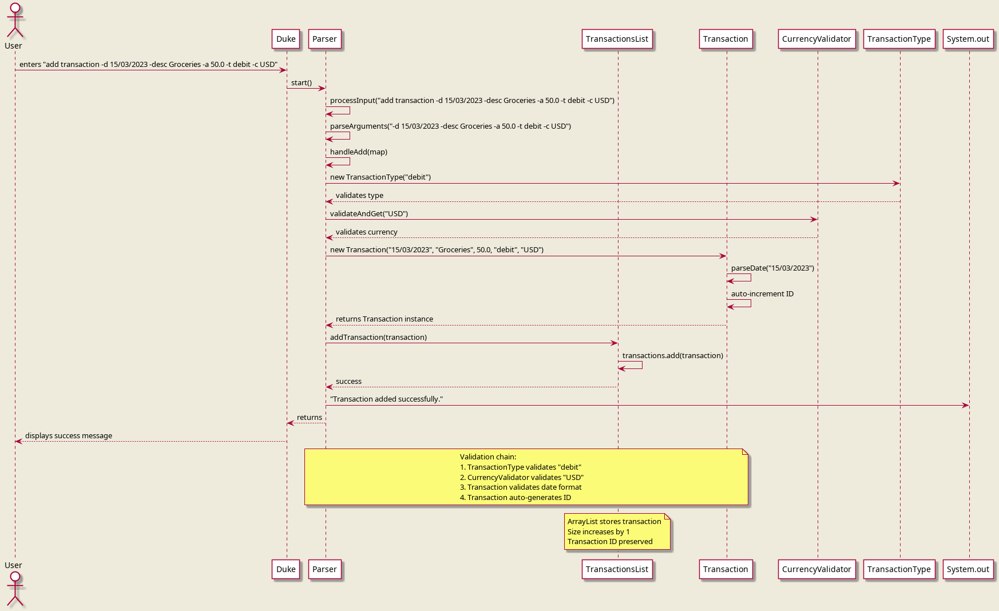
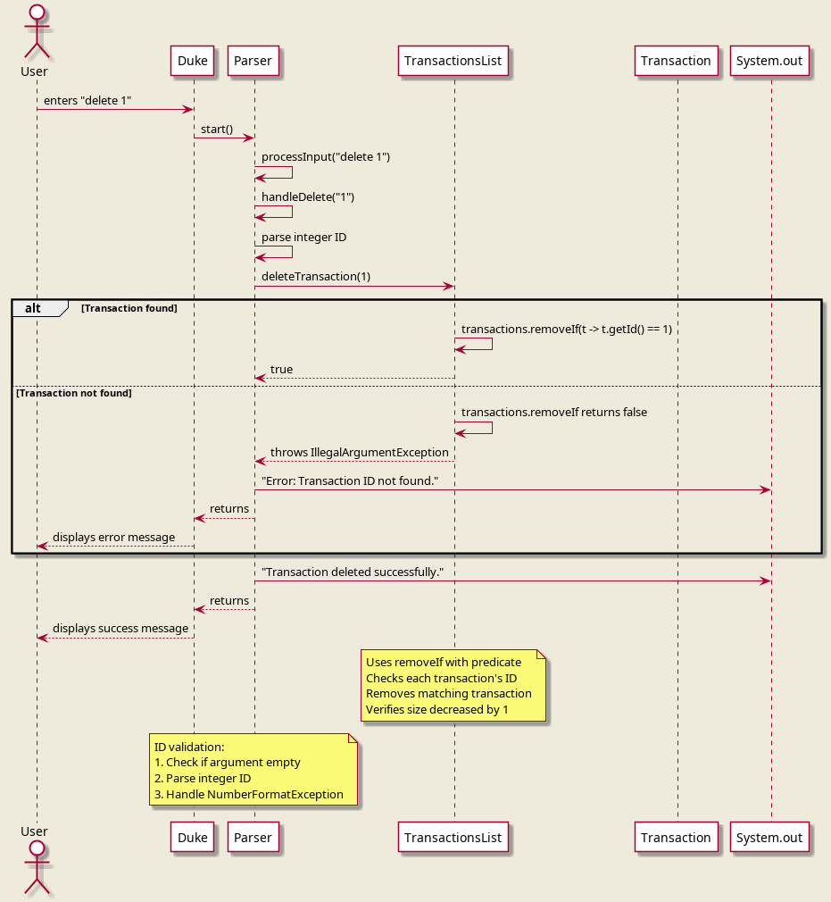
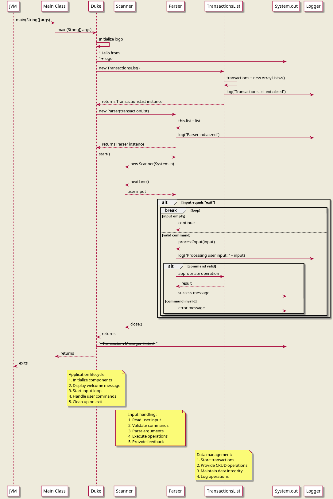

# Developer Guide

## Acknowledgements

This project is built on the Java platform and follows object-oriented design principles. The application structure is inspired by the individual project iP.

**Note**: The PlantUML diagram source files are located in the `docs/diagrams/` directory. To generate PNG images from the `.puml` files, use a PlantUML tool or online generator.

## Design & Implementation

### Architecture

The following architecture diagram provides a high-level view of the Transaction Manager system:


The Transaction Manager follows a layered architecture with the following main components:

1. **Main**: The entry point that initializes all components and starts the application loop.
2. **Parser**: Handles user input parsing, command validation, and delegates operations to the TransactionsList.
3. **TransactionsList**: Manages the collection of Transaction objects and provides CRUD operations.
4. **Transaction**: Represents individual financial transactions with validation and data integrity.
5. **Validators**: Utility classes (CurrencyValidator, TransactionType) that enforce business rules.

The components interact as follows:
- `Duke` creates and initializes `Parser` and `TransactionsList`.
- `Parser` processes user commands and calls methods on `TransactionsList`.
- `TransactionsList` manages `Transaction` objects and uses validators for data integrity.
- `Transaction` objects encapsulate individual transaction data and validation logic.

(Modifications: add currency conversion)


### Design Considerations

**Transaction Storage**: Transactions are stored in an ArrayList for efficient random access and iteration. This design choice supports the application's requirement for fast listing and editing operations.

**Command Parsing**: The Parser uses simple string splitting and HashMap storage for command arguments, providing flexibility for future command extensions without complex parsing logic.

**Validation Separation**: Validation logic is separated into dedicated classes (CurrencyValidator, TransactionType) to follow the Single Responsibility Principle and enable easy testing and modification.

### Component-Level Design

#### Parser Component
The Parser component is responsible for:
- Reading user input from the console
- Parsing command strings into actionable operations
- Validating command syntax and arguments
- Delegating operations to the TransactionsList component
- Providing user feedback and error messages

Key implementation details:
- Uses Scanner for input reading
- Implements command pattern via switch statements
- Parses arguments using regex pattern matching
- Provides comprehensive error handling

#### Transaction Management Component
The TransactionsList component provides:
- Storage and management of Transaction objects
- Auto-incremented ID generation
- CRUD operations (add, list, edit, delete, clear)
- Data integrity maintenance

Key implementation details:
- Uses ArrayList for efficient storage
- Implements auto-increment IDs
- Provides transactional operations with proper error handling
- Includes logging for debugging and monitoring

#### Model Components
The Transaction, TransactionType, and CurrencyValidator classes form the data model:
- **Transaction**: Represents a financial transaction with date, description, amount, type, and currency
- **TransactionType**: Validates and stores transaction type (debit/credit)
- **CurrencyValidator**: Validates currency codes against an approved list

### Class Diagrams

The following class diagram shows the relationships between all components:


**Key Relationships**:
- `Duke` aggregates `Parser` and `TransactionsList`
- `Parser` uses `TransactionsList` for operations
- `TransactionsList` contains multiple `Transaction` objects
- `Transaction` uses `TransactionType` and `CurrencyValidator`
- All components use Java's built-in collections and utilities

## Product Scope

### Target User Profile

The Transaction Manager is designed for:

- **Individuals** who need to track personal financial transactions
- **Small business owners** who require simple expense tracking
- **Students** learning about financial management
- **Users comfortable with command-line interfaces**
- **Those who prefer typing over mouse interactions**
- **People who need to manage up to 1000 transactions efficiently**

### Value Proposition

The Transaction Manager solves several key problems:

1. **Simplified Financial Tracking**: Provides a straightforward way to record and manage financial transactions without complex accounting software.
2. **Rapid Data Entry**: Command-line interface allows for faster transaction entry compared to GUI applications for users comfortable with typing.
3. **Data Integrity**: Built-in validation ensures consistent data format and prevents common data entry errors.
4. **Portability**: Lightweight Java application that runs on any platform with Java 17+ installed.
5. **Educational Value**: Serves as a learning tool for understanding object-oriented design, validation patterns, and command-line application development.

## User Stories

| Version | As a ... | I want to ... | So that I can ... |
|---------|----------|---------------|-------------------|
| v1.0 | new user | see usage instructions | refer to them when I forget how to use the application |
| v1.0 | user | add a new transaction | record my financial activities |
| v1.0 | user | list all transactions | view my transaction history |
| v1.0 | user | edit a transaction | correct mistakes in previously recorded transactions |
| v1.0 | user | delete a transaction | remove erroneous or duplicate entries |
| v1.0 | user | clear all transactions | start fresh with a clean transaction list |
| v2.0 | user | filter transactions by date | review transactions from specific time periods |
| v2.0 | user | search transactions by description | find specific transactions quickly |
| v2.0 | user | validate my transactions | ensure my double-entry accounts are balanced |
| v2.0 | user | add new categories under each account type | filter by transaction easily and see where I am spending my money |
| v2.0 | user | be able to categorise transactions  | filter by transaction type |
| v2.0 | user | generate balance sheet report  | get a detailed look into my assets |

## Non-Functional Requirements

1. **Performance**
   - Should handle up to 1000 transactions without noticeable performance degradation
   - Command response time should be under 100ms for typical operations
   - Memory usage should remain under 100MB for maximum transaction load

2. **Reliability**
   - Application should not crash on invalid user input
   - Data should remain consistent during CRUD operations
   - Error messages should be helpful and actionable

3. **Usability**
   - Command syntax should be intuitive and consistent
   - Help text should be accessible via a help command
   - Error messages should clearly indicate what went wrong and how to fix it

4. **Maintainability**
   - Code should follow Java coding standards
   - Comprehensive unit tests should cover critical functionality
   - Code should be well-documented with JavaDoc comments
   - Separation of concerns should be maintained between components

5. **Portability**
   - Should run on any operating system with Java 17 or above
   - Should not require external dependencies beyond standard Java libraries
   - Configuration should be minimal or non-existent

## Implementation Details

### Feature 1: Command Parsing & Validation System
**Implemented by: Team Member 1**  
**Files**: `Parser.java`, `TransactionType.java`, `CurrencyValidator.java`

#### How it's Implemented
The command parsing system handles user input through a multi-stage validation process:

1. **Input Processing**: The `Parser.start()` method reads user input using `Scanner.nextLine()` and processes each line.
2. **Command Recognition**: Commands are identified using a switch statement on the first word of input.
3. **Argument Parsing**: Arguments are parsed using regex pattern matching that splits on flags (words starting with `-`).
4. **Validation Chain**: Each component validates its specific data:
   - `TransactionType` validates transaction type (must be "debit" or "credit")
   - `CurrencyValidator` validates currency codes (must be "SGD", "USD", or "EUR")
   - `Transaction` validates date format (must be "DD/MM/YYYY")

**Sequence Diagram - Add Transaction Command**:


```java
// Example from Parser.java:96-118
private void handleAdd(String args) {
    Map<String, String> map = parseArguments(args);
    String date = map.get("-d");
    String desc = map.get("-desc");
    String amountStr = map.get("-a");
    String type = map.get("-t");
    String currency = map.get("-c");

    if (amountStr == null) {
        throw new IllegalArgumentException("Missing amount.");
    }

    double amount;
    try {
        amount = Double.parseDouble(amountStr);
    } catch (NumberFormatException e) {
        throw new IllegalArgumentException("Amount must be a valid number.");
    }

    Transaction t = new Transaction(date, desc, amount, type, currency);
    list.addTransaction(t);
    System.out.println("Transaction added successfully.");
}
```

#### Why Implemented This Way
1. **Separation of Concerns**: Validation logic is separated into dedicated classes (`TransactionType`, `CurrencyValidator`) making each class responsible for a single validation rule.
2. **Extensibility**: The argument parsing using regex and HashMap allows easy addition of new command flags without restructuring the parsing logic.
3. **Error Handling**: Each validation point throws specific exceptions with clear error messages, making debugging easier.
4. **Testability**: Each validator can be tested independently, and mock objects can be used to test the Parser without full system dependencies.

#### Alternatives Considered
1. **Using a Command Pattern**: Could have implemented each command as a separate class implementing a Command interface. Rejected due to increased complexity for a small application.
2. **Using External Parsing Libraries**: Libraries like Apache CLI or JCommander could have been used. Rejected to minimize dependencies and keep the application lightweight.
3. **Inline Validation**: Could have placed validation logic directly in the Transaction constructor. Rejected to improve code organization and reusability.

#### Class Diagram - Parser Component Relationships
The Parser component interacts with validation classes as shown in the main class diagram. Key relationships include:
- `Parser` creates and uses `TransactionType` instances
- `Parser` calls `CurrencyValidator.validateAndGet()` statically
- `Parser` delegates to `TransactionsList` for operations
- All validation failures throw `IllegalArgumentException` with descriptive messages

### Feature 2: Transaction Storage & Management
**Implemented by: Team Member 2**  
**Files**: `TransactionsList.java`

#### How it's Implemented
The transaction storage system provides in-memory management of financial transactions:

1. **Data Structure**: Uses `ArrayList<Transaction>` for storage, providing O(1) amortized time for add operations and O(n) for search/delete operations.
2. **ID Management**: Implements auto-incremented IDs using a static counter in the `Transaction` class.
3. **CRUD Operations**: Provides comprehensive Create, Read, Update, Delete functionality:
   - `addTransaction()`: Adds new transactions with validation
   - `listTransactions()`: Displays all transactions with formatted output
   - `editTransaction()`: Updates specific fields of existing transactions
   - `deleteTransaction()`: Removes transactions by ID
   - `clearTransactions()`: Removes all transactions
4. **Error Handling**: Validates ID existence and provides clear error messages.

**Sequence Diagram - Delete Transaction Command**:


```java
// Example from TransactionsList.java:38-46
public void deleteTransaction(int id) {
    int initialSize = transactions.size();
    boolean removed = transactions.removeIf(t -> t.getId() == id);
    if (!removed) {
        throw new IllegalArgumentException("Transaction ID not found.");
    }
    assert transactions.size() == initialSize - 1 : "Transaction list size did not decrease by exactly one.";
    logger.log(Level.INFO, "Delete Transaction " + id);
}
```

#### Why Implemented This Way
1. **ArrayList Choice**: Selected ArrayList over LinkedList for better cache locality and O(1) random access, which suits the typical use case of sequential listing.
2. **Auto-increment IDs**: Using static counter ensures unique IDs without requiring synchronization in this single-threaded application.
3. **Transactional Operations**: Each operation maintains data integrity through pre- and post-conditions using assertions.
4. **Logging Integration**: Uses Java's built-in logging framework to track operations for debugging and monitoring.

#### Alternatives Considered
1. **LinkedList**: Considered for O(1) removal operations, but ArrayList was chosen for better iteration performance during listing.
2. **HashMap for ID lookup**: Considered maintaining a HashMap<ID, Transaction> for O(1) lookup, but rejected due to increased memory overhead and synchronization complexity.
3. **Database Backend**: Considered using SQLite or similar embedded database, but rejected to keep the application lightweight and dependency-free.
4. **Immutable Transactions**: Considered making Transaction objects immutable, but chose mutable design with update method to support partial updates.

#### Performance Considerations
- **Memory**: Each Transaction object stores primitive types and Strings, minimizing memory overhead.
- **Time Complexity**: 
  - Add: O(1) amortized
  - List: O(n)
  - Delete: O(n) due to search by ID
  - Edit: O(n) due to search by ID
- **Scalability**: Designed to handle up to 1000 transactions efficiently.

### Feature 3: Transaction Data Model & Core Application Flow
**Implemented by: Team Member 3**  
**Files**: `Transaction.java`, `Duke.java`

#### How it's Implemented
The Transaction data model and main application flow provide the foundation for the system:

1. **Transaction Object Model**:
   - **Attributes**: ID (auto-incremented), date (LocalDate), description (String), amount (double), type (TransactionType), currency (String)
   - **Validation**: Constructor validates all required fields; date parsing enforces "DD/MM/YYYY" format
   - **Update Method**: Supports partial updates where null parameters preserve existing values
   - **Immutability**: Transaction objects are mutable via update() but maintain data integrity through validation

2. **Main Application Flow** (`Duke.java`):
   - **Initialization**: Creates TransactionsList and Parser instances
   - **Input Loop**: Continuously reads user input until "exit" command
   - **Error Handling**: Catches exceptions and displays user-friendly messages
   - **Clean Shutdown**: Properly closes Scanner and displays exit message

**Sequence Diagram - Application Startup**:


```java
// Example from Transaction.java:21-37
public Transaction(String dateStr, String description, Double amount, String typeStr, String currencyStr) {
    if (dateStr == null || description == null || amount == null || typeStr == null || currencyStr == null) {
        throw new IllegalArgumentException("Missing required transaction details.");
    }
    if (description.trim().isEmpty()) {
        throw new IllegalArgumentException("Description cannot be empty.");
    }

    this.id = nextId++;
    assert this.id > 0 : "Auto-incremented ID must be positive.";

    this.date = parseDate(dateStr);
    this.description = description;
    this.amount = amount;
    this.type = new TransactionType(typeStr);
    this.currency = CurrencyValidator.validateAndGet(currencyStr);
}
```

#### Why Implemented This Way
1. **Rich Object Model**: Transaction encapsulates all related data and behavior, following object-oriented principles.
2. **Validation in Constructor**: Ensures Transaction objects are always in a valid state when created.
3. **Auto-increment IDs**: Simplifies ID management without requiring the TransactionsList to coordinate ID assignment.
4. **Partial Updates**: The update() method allows modifying specific fields without requiring all fields to be resent.
5. **Separation of Concerns**: Duke handles application lifecycle, Transaction handles data representation, and Parser handles user interaction.

#### Alternatives Considered
1. **Builder Pattern**: Considered using a Builder for Transaction creation but rejected due to simplicity of current use cases.
2. **Immutable Transactions**: Considered making Transaction immutable but chose mutable design to support the update() operation efficiently.
3. **External ID Generation**: Could have moved ID generation to TransactionsList but kept it in Transaction for simplicity and thread-safety in this single-threaded application.
4. **Date as String**: Considered storing date as String but chose LocalDate for proper date manipulation capabilities.

#### Design Patterns Used
1. **Factory Method Pattern**: Transaction constructor acts as a factory for valid Transaction objects.
2. **Validator Pattern**: CurrencyValidator and TransactionType follow the Validator pattern.
3. **Command Pattern**: Parser interprets user commands as actions on the TransactionsList.
4. **Repository Pattern**: TransactionsList acts as a repository for Transaction objects.

## Glossary

* **Transaction**: A financial record containing date, description, amount, type (debit/credit), and currency.
* **Debit**: A transaction representing money leaving an account (expense, payment).
* **Credit**: A transaction representing money entering an account (income, deposit).
* **Currency Code**: Three-letter ISO currency code (SGD, USD, EUR).
* **Parser**: Component responsible for interpreting user commands and delegating to appropriate handlers.
* **TransactionsList**: Repository managing the collection of Transaction objects.
* **Validation**: Process of ensuring data meets predefined rules before processing.
* **Auto-increment ID**: Automatically generated unique identifier for each transaction.
* **CRUD Operations**: Create, Read, Update, Delete - the four basic operations of persistent storage.

## Instructions for Manual Testing

### Launch and Shutdown Testing

1. **Initial Launch**
   - Download the JAR file and copy to an empty folder
   - Open terminal/command prompt in that folder
   - Run `java -jar duke.jar`
   - Expected: Shows the application logo and welcome message
   - Expected: Application waits for user input with prompt

2. **Normal Shutdown**
   - Type `exit` and press Enter
   - Expected: Application displays "--- Transaction Manager Exited ---" and terminates cleanly

3. **Invalid Command Handling**
   - Type `invalidcommand` and press Enter
   - Expected: Error message "Unknown command. Use add, list, edit, delete, or clear."

### Adding Transactions

1. **Valid Transaction Addition**
   ```
   add transaction -d 15/03/2023 -desc Groceries -a 50.0 -t debit -c USD
   ```
   Expected: "Transaction added successfully."

2. **Missing Required Fields**
   ```
   add transaction -desc Groceries -t debit -c USD
   ```
   Expected: Error "Missing amount."

3. **Invalid Date Format**
   ```
   add transaction -d 2023-03-15 -desc Groceries -a 50.0 -t debit -c USD
   ```
   Expected: Error "DATE must be in DD/MM/YYYY format."

4. **Invalid Currency**
   ```
   add transaction -d 15/03/2023 -desc Groceries -a 50.0 -t debit -c JPY
   ```
   Expected: Error "Currency must be one of: SGD, USD, EUR."

5. **Invalid Transaction Type**
   ```
   add transaction -d 15/03/2023 -desc Groceries -a 50.0 -t withdraw -c USD
   ```
   Expected: Error "Type must be strictly 'debit' or 'credit'."

### Listing Transactions

1. **Empty List**
   ```
   list
   ```
   Expected: "No transactions found."

2. **After Adding Transactions**
   ```
   add transaction -d 15/03/2023 -desc Salary -a 5000.0 -t credit -c SGD
   add transaction -d 16/03/2023 -desc Rent -a 1200.0 -t debit -c SGD
   list
   ```
   Expected: Lists both transactions with formatted output showing ID, date, description, amount, type, and currency.

### Editing Transactions

1. **Valid Edit**
   ```
   edit 1 -a 5500.0 -desc "Monthly Salary"
   ```
   Expected: "Transaction edited successfully."

2. **Edit Non-existent Transaction**
   ```
   edit 999 -a 100.0
   ```
   Expected: Error "Transaction ID not found."

3. **Partial Edit**
   ```
   edit 1 -d 20/03/2023
   ```
   Expected: Only date is updated, other fields remain unchanged.

### Deleting Transactions

1. **Valid Delete**
   ```
   delete 1
   ```
   Expected: "Transaction deleted successfully."

2. **Delete Non-existent Transaction**
   ```
   delete 999
   ```
   Expected: Error "Transaction ID not found."

3. **Delete with Invalid ID**
   ```
   delete abc
   ```
   Expected: Error "Transaction ID must be an integer."

### Clearing All Transactions

1. **Clear Command**
   ```
   clear
   ```
   Expected: "All transactions have been cleared."

2. **Verify Clear**
   ```
   list
   ```
   Expected: "No transactions found."

### Edge Case Testing

1. **Empty Description**
   ```
   add transaction -d 15/03/2023 -desc "" -a 50.0 -t debit -c USD
   ```
   Expected: Error "Description cannot be empty."

2. **Whitespace Description**
   ```
   add transaction -d 15/03/2023 -desc "   " -a 50.0 -t debit -c USD
   ```
   Expected: Error "Description cannot be empty."

3. **Negative Amount**
   ```
   add transaction -d 15/03/2023 -desc Refund -a -50.0 -t credit -c USD
   ```
   Expected: Transaction added successfully (negative amounts allowed for credits/debits).

4. **Very Large Amount**
   ```
   add transaction -d 15/03/2023 -desc LargeTransaction -a 999999999.99 -t debit -c USD
   ```
   Expected: Transaction added successfully (double precision handles large values).

### Integration Testing

1. **Complete Workflow**
   ```
   add transaction -d 15/03/2023 -desc Salary -a 5000.0 -t credit -c SGD
   add transaction -d 16/03/2023 -desc Rent -a 1200.0 -t debit -c SGD
   add transaction -d 17/03/2023 -desc Groceries -a 150.5 -t debit -c SGD
   list
   edit 2 -a 1250.0 -desc "Rent Payment"
   delete 3
   list
   clear
   list
   exit
   ```
   Expected: All operations complete successfully with appropriate messages.

### Performance Testing

1. **Add 100 Transactions**
   - Create a script or manually add 100 transactions
   - Expected: All transactions added without performance degradation
   - Expected: `list` command displays all 100 transactions within reasonable time

2. **Memory Usage**
   - Monitor memory usage during operations
   - Expected: Memory usage scales linearly with number of transactions
   - Expected: No memory leaks after clearing transactions
