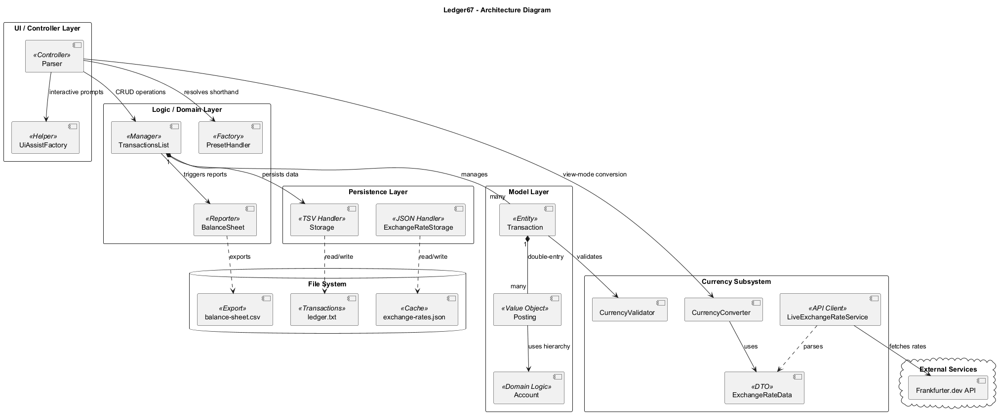
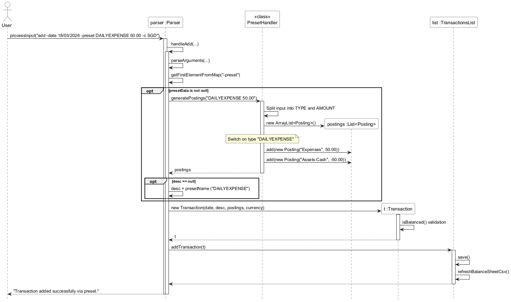
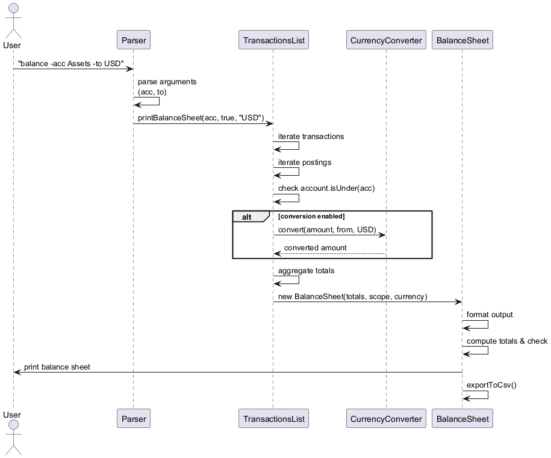
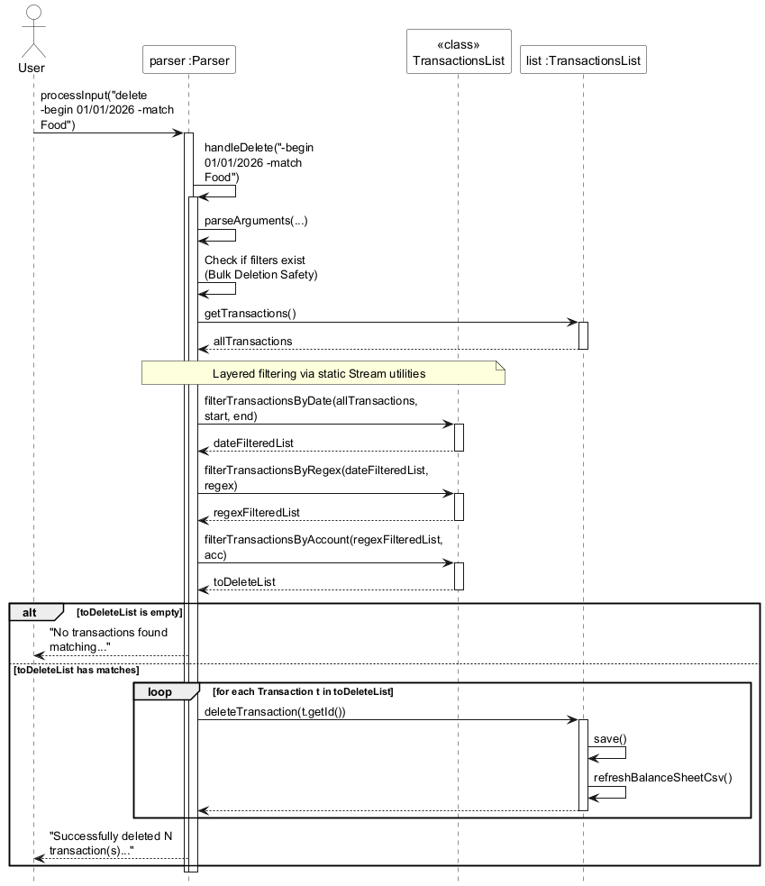
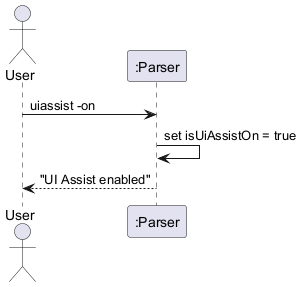

# Developer Guide

## Acknowledgements

This project is built on the Java platform and follows object-oriented design principles. The application structure is inspired by the individual project iP.

**Note**: The PlantUML diagram source files are located in the `docs/diagrams/` directory. To generate PNG images from the `.puml` files, use a PlantUML tool or online generator.

## Design & Implementation

### Architecture Overview

Ledger67 is built on a layered architecture that emphasizes data integrity through double-entry bookkeeping principles. It follows a **Model-View-Controller (MVC)** inspired pattern, adapted for a stateful Command Line Interface (CLI).



1.  **Main (Ledger67)**: The entry point. It initializes the infrastructure (Storage, Currency Services), loads existing data, and bootstraps the `Parser` to start the execution loop.
2.  **Controller (Parser & UiAssistFactory)**: 
    *   **Parser**: The central engine that interprets CLI inputs. It features a **Stateful Workflow** for multi-step commands (e.g., `convert` → `confirm`).
    *   **UiAssistFactory**: An interactive layer that intercepts commands when "UI Assist" mode is active, prompting users for required fields to build valid CLI arguments.
3.  **Logic Layer (TransactionsList & PresetHandler)**:
    *   **TransactionsList**: The domain manager. It handles filtering (Regex, Date, Account), CRUD operations, and invokes the `BalanceSheet` engine.
    *   **PresetHandler**: A factory that transforms shorthand keywords (e.g., `DAILYEXPENSE`) into full double-entry posting sets.
4.  **Model Layer (Transaction, Posting, Account)**: Encapsulates the financial logic, ensuring that every entry adheres to the fundamental accounting equation.
5.  **Persistence Layer (Storage & ExchangeRateStorage)**: Handles flat-file persistence (TSV for transactions, JSON for exchange rates).
6.  **Currency Engine**: A specialized subsystem consisting of a `LiveExchangeRateService` (API client), `CurrencyConverter`, and `CurrencyValidator`.

---

### Design Considerations

**1. Double-Entry Integrity**  
Unlike simple expense trackers, Ledger67 enforces a "Balanced" rule for every transaction. A transaction is only committed if the sum of its internal amounts equals zero, following the equation:  
Assets = Liabilities + Equity

Where Equity is affected by Income and Expenses:
Equity = Initial Equity + (Income - Expenses)

**2. Hierarchical Account System**  
Accounts are not flat strings; they are hierarchical objects (`Account`). This allows users to categorize finances using colons (e.g., `Assets:Bank:DBS`) and enables the system to perform "roll-up" reporting where a filter for `Assets` includes all sub-accounts.

**3. Hybrid Input Modes**  
The system bridges the gap between power users and beginners. It supports a **Flag-based CLI** (fast, regex-compatible) and an **Interactive UI Assist** mode (guided, prompt-based) that generates the underlying CLI commands for the user.

**4. Stateful Confirmation Workflow**  
To prevent accidental data modification during currency conversion or bulk listing, the `Parser` implements a "Pending state." This allows users to preview converted values in "View-Only" mode before explicitly committing them via a `confirm` command.

**5.  Monetary Precision**
Ledger67 stores monetary values using **2 decimal places**, which is standard for currency amounts.

If users enter values with more than 2 decimal places, Ledger67 will round them before storing them.

Examples:
- `100.999999` is stored as `101.00`
- `50.1` is stored as `50.10`
- `75.555` is stored as `75.56`

**5.  Sign Convention**
- Ledger67 uses a **signed amount model** instead of debit/credit.
- Ledger67 only checks that transactions are **balanced**, and does not enforce sign conventions.
- Users are encouraged to follow the recommended usage for consistency.

---

### Component-Level Design

#### Parser & UI Component
*   **Flag Parsing**: Uses regex-based tokenization to support non-positional arguments (e.g., `-date`, `-desc`, `-p`).
*   **Command Delegation**: Maps input to specialized handlers like `handleAdd`, `handleList`, and `handleConvert`.
*   **UI Assistance**: When enabled, `UiAssistFactory` uses a `Scanner` to interactively collect data, ensuring mandatory flags are never omitted.

#### Transaction Management Component
*   **Filtering Engine**: Utilizes Java Streams and functional predicates to layer filters. Users can filter by account prefix, date ranges, and case-insensitive regex descriptions simultaneously.
*   **Balance Sheet Generation**: Aggregates totals across all accounts, calculates "Net Income" from Income/Expense accounts, and validates the accounting equation. It provides dual output: a formatted console view and an automated CSV export for external analysis.

#### Currency Engine
*   **External Integration**: `LiveExchangeRateService` fetches real-time data from the Frankfurter API using Java’s `HttpClient`.
*   **Conversion Logic**: The `CurrencyConverter` uses a base-currency (EUR) triangulation method to convert between any two supported currencies (SGD, USD, EUR) based on cached or live rates.

---

### Model Components

*   **Transaction**: The core entity. It contains an auto-incrementing ID, metadata (Date, Description, Currency), and a `List<Posting>`. It acts as the final gatekeeper for data integrity via the `isBalanced()` check.
*   **Posting**: Represents a single entry in a ledger. It links an `Account` to a `double` amount. It handles the sign-convention logic (e.g., determining if a positive value in an "Income" account represents an increase or decrease in the internal equation).
*   **Account**: Manages the validation of "Root" accounts (Assets, Liabilities, Equity, Income, Expenses) and handles the logic for hierarchical membership (`isUnder`).
*   **ExchangeRateData**: A Data Transfer Object (DTO) used for GSON serialization/deserialization of currency rates.

---

### Data Persistence
*   **Transaction Storage**: Uses a custom tab-separated format (`ledger.txt`). Complex objects like the list of `Postings` are serialized into a semicolon-delimited string within the file to maintain a flat structure while preserving the multi-entry nature of double-entry bookkeeping.
*   **Rate Storage**: Uses `exchange-rates.json` to cache API results, allowing the application to function offline using fallback or previously fetched data.


## Implementation Details

### Transaction Flow
**Implementer: Pran, JJ**

The transaction flow manages the lifecycle of financial records, ensuring that every entry satisfies the fundamental accounting equation before being persisted.

#### 1. Create (Add) Flow
The addition process supports two paths: **Manual Entry** (providing specific postings) or **Preset Entry** (using templates).
*   **Input**: If `isUiAssistOn` is true, the `UiAssistFactory` interactively prompts the user for fields. Otherwise, the `Parser` extracts flags directly.
*   **Processing**:
    *   If a `-preset` is used, the `PresetHandler` generates a `List<Posting>` (e.g., swapping Assets for Expenses).
    *   The `Parser` validates the currency and date format.
    *   The `Transaction` object is instantiated and must pass an `isBalanced()` check (Sum of postings ≈ 0).
*   **Finalization**: `TransactionsList` appends the transaction, triggers `Storage` to save, and refreshes the background `balance-sheet.csv`.


#### 2. Read (List/Filter) Flow
Listing is non-destructive and supports layered filtering.
*   **Filtering**: `TransactionsList` applies filters in sequence: Date Range → Regex Match → Account Hierarchy (e.g., filtering for `Assets` includes `Assets:Cash`).
*   **View-Only Conversion**: If the `-to` flag is present, the `Parser` sets a **Pending State**. The `TransactionsList` renders the converted values for preview but does not modify the underlying data unless a `confirm` command follows.


#### 3. Update (Edit) Flow
Updates allow modifying any part of an existing transaction while enforcing re-validation.
*   **Lookup**: `TransactionsList` retrieves the transaction by ID.
*   **Modification**: The `Transaction.update()` method selectively replaces fields (Date, Desc, Currency, or Postings).
*   **Validation**: If postings are updated, the `isBalanced()` check is re-run. If the new set is unbalanced, the update is aborted.


#### 4. Delete Flow (Single & Bulk)
Deletion supports targeted removal or mass-clearing based on filters.
*   **Single**: Deletes a specific transaction by its unique ID.
*   **Bulk**: Uses the same filtering engine as the `list` command to identify a sub-set of transactions for removal.
*   **Safety**: Bulk deletion requires at least one filter flag to prevent accidental total wipes (users must use `clear` for that).


---

### Updated Transaction Data Model
The `Transaction` model is designed for **Double-Entry Bookkeeping**:

*   **Identity & Metadata**: Contains a unique `int id`, `LocalDate date`, `String description`, and `String currency`.
*   **Postings**: Instead of a single amount, it holds a `List<Posting>`. Each `Posting` links a specific `Account` to a `double` amount.
*   **Account Logic**: The `Account` class validates that the root is one of the five standard types: *Assets, Liabilities, Equity, Income, Expenses*. It handles colon-delimited hierarchy (e.g., `Expenses:Food`).
*   **Balance Integrity**: 
    *   `Posting.getInternalAmount()`: Translates external user numbers into internal accounting signs based on the account type (e.g., a positive number in `Expenses` is a debit, while a positive number in `Income` is a credit).
    *   `Transaction.isBalanced()`: Sums all `internalAmounts`. The transaction is valid only if the total is zero (within a $10^{-4}$ tolerance for floating-point precision).
*   **Persistence**: Serialized as a Tab-Separated Value (TSV) line where postings are encoded as `Account1=Amount;Account2=Amount`.

---

#### Design Considerations
*   **Validation Timing (Balanced vs. Unbalanced):** 
    *   The system checks if the sum of all postings in a transaction equals zero. 
    *   **Decision:** We allow the creation of an "unbalanced" transaction object in memory during the parsing phase to provide specific feedback (e.g., "Your transaction is off by 5.00"), but we prevent it from being committed to the `TransactionsList` or `Storage`.
*   **Atomicity:** 
    *   By grouping all postings into a single `Transaction` object, we ensure that an "Office Supply" purchase either fails entirely or succeeds entirely. It is impossible to have an expense recorded without a corresponding deduction from assets.

#### Alternatives Considered
*   **Alternative 1: Flat String Postings:** Storing postings as a simple list of strings within the Transaction class.
    *   **Pros:** Easier to parse and store.
    *   **Cons:** Extremely difficult to perform mathematical validations or hierarchical filtering.
    *   **Decision:** We implemented a dedicated `Posting` class with numeric `amount` and structured `Account` objects to enable rigorous accounting checks.
*   **Alternative 2: Single-entry Legacy System:** Storing one account and one amount per line.
    *   **Pros:** Simpler CLI syntax (`add -a 50 -acc Food`).
    *   **Cons:** Violates fundamental accounting principles and makes it impossible to track where the money came from (e.g., Cash vs. Credit Card).
    *   **Decision:** Shifted to the multi-posting `-p` flag system to support true double-entry bookkeeping.


### Storage Feature

Implementer: JJ
The storage feature is responsible for persisting transaction data to local file storage and restoring it upon application startup.

---

#### 1. Transaction Persistence
The `Storage` class manages reading from and writing to a local text file (`ledger.txt`).
* Transactions are saved in a tab-separated format
* Each transaction includes ID, date, description, amount, type, and currency
* Data is written immediately after every modifying operation (add, edit, delete, clear)

This ensures:
* Data durability across application runs
* Minimal risk of data loss

---

#### 2. Loading Transactions
Upon application startup, `Storage` loads all previously saved transactions into memory.
* Reads file line-by-line
* Parses each line into a `Transaction` object
* Reconstructs transaction IDs and updates the auto-increment counter

Invalid or malformed lines are safely ignored to prevent crashes.

---

#### 3. Data Encoding and Decoding
To ensure file integrity, special characters are handled using escaping:
* `\t` for tabs
* `\n` for newlines
* `\\` for backslashes
  This prevents corruption of the file format when storing user input.

---

#### 4. Integration with TransactionsList
The `TransactionsList` component interacts directly with `Storage`:
* Calls `load()` during initialization
* Calls `save()` after every modification

This design ensures:
* Separation of concerns between data management and persistence
* Consistent synchronization between memory and disk

---

#### Design Considerations
* **Immediate Persistence**: Data is saved after every operation to prevent loss
* **Simple File Format**: Tab-delimited text allows easy debugging and readability
* **Robustness**: Invalid data is safely handled without crashing the application
* **Encapsulation**: Storage logic is isolated from business logic in `TransactionsList`

#### Sequence Diagram


The diagram above shows:
* `TransactionsList` triggering save operations
* `Storage` writing transaction data to file 
* Data being reloaded when the application starts

---

### Currency Conversion Feature

Implementer: JJ

The currency conversion feature extends the system by introducing dynamic currency handling, persistent exchange rate storage, and real-time rate retrieval.

---

#### Integration with Architecture
This feature introduces and integrates the following components:
* `CurrencyConverter`: Core conversion logic
* `ExchangeRateData`: Data model for exchange rates
* `ExchangeRateStorage`: Handles persistent storage of exchange rates
* `LiveExchangeRateService`: Fetches real-time exchange rates

These components are connected as follows:
* `Duke` initializes the converter and injects it into `Parser` and `TransactionsList`
* `Parser` handles `convert` and `rates` commands
* `TransactionsList` uses the converter for display-level conversions
* `ExchangeRateStorage` ensures exchange rates persist across application runs

---

#### 1. Simple Currency Conversion
The `CurrencyConverter` class provides the core conversion logic via the `convert()` method.
* Validates currencies using `CurrencyValidator`
* Converts via a base currency for consistency
* Handles same-currency conversion as a no-op

---

#### 2. Exchange Rate Storage
The `ExchangeRateStorage` component ensures exchange rate data is persisted locally.
* Loads exchange rates from a JSON file at application startup
* Saves updated rates after fetching from the API
* Ensures data validity before reading or writing

This allows the application to:
* Avoid repeated API calls
* Maintain functionality even without internet access

---

#### 3. Live Exchange Rate Integration
The `LiveExchangeRateService` fetches real-time exchange rates from an external API.
* Sends HTTP requests to retrieve latest rates
* Parses JSON responses into `ExchangeRateData`
* Updates local storage via `ExchangeRateStorage`
* Triggered using the `rates refresh` command

A fallback mechanism in `Duke` ensures the system remains functional if live data retrieval fails.

---

#### 4. Conversion of Stored Transactions
Stored transactions can be converted dynamically without modifying underlying data.
Implemented in:
* `Parser` (`convert transaction` command)
* `TransactionsList` (conversion during display)

Features:
* Converts a transaction by ID
* Uses latest available exchange rates
* Preserves original stored values

---

#### 5. Display Currency Conversion (List View)
Transactions can be displayed in a selected currency using:
```
list -to USD
```

* Uses `setDisplayCurrency()` and `setAutoConvertDisplay()`
* Conversion is applied during output rendering
* Does not overwrite stored transaction data

---

#### Design Considerations
* **Separation of Concerns**: Conversion, storage, and API handling are modularized
* **Persistence**: Exchange rates are stored locally to improve performance and reliability
* **Resilience**: Fallback data ensures continued functionality without API access

#### Sequence Diagram


The diagram above illustrates how user input flows through the system:
* `Parser` extracts and validates inputs
* `CurrencyValidator` ensures valid currencies
* `CurrencyConverter` performs the conversion 
* Results are displayed without modifying stored data

---


#### 6. Confirm and Store Converted Transactions

This feature extends the currency conversion system by allowing users to **persist converted values into storage**, 
instead of keeping them as view-only.
Previously, all conversion operations (`convert`, `convert transaction`, `list transaction -to`) were strictly **non-destructive**.

---

#### Implementation Details
This feature is implemented primarily in the `Parser` component through **stateful command handling**.

New internal state variables in `Parser`:

* `pendingTransactionId`: stores the transaction ID (for single conversion)
* `pendingTargetCurrency`: stores the selected target currency
* `pendingFromListView`: indicates whether the conversion came from list view



##### Workflow
##### Case 1: `convert transaction`
1. User runs:
   ```
   convert transaction 3 -to SGD
   ```
2. System:
    * Calculates converted value
    * Displays result
    * Stores pending state (ID + currency)
3. User enters:
   ```
   confirm
   ```
4. System:
    * Calls `TransactionsList.editTransaction(...)`
    * Updates:
        * amount
        * currency
    * Persists changes via `Storage.save()`
---

##### Case 2: `list -to`
1. User runs:
   ```
   list -to SGD
   ```
2. System:
    * Displays converted values (view-only)
    * Stores pending state (currency + list mode)
3. User options:
    * `confirm all` → update all transactions
    * `confirm ID` → update one transaction
4. System:
    * Iterates through transactions (if all)
    * Applies conversion
    * Persists via `Storage`

---

#### Design Considerations
* **Explicit Confirmation Required**
    * Prevents accidental data mutation
    * Maintains safety of original financial records
* **Stateful Parser Design**
    * Enables multi-step commands (view → confirm)
    * Avoids modifying core model classes
* **Reuse of Existing Logic**
    * Uses `editTransaction()` instead of creating new update methods

---

#### Sequence Diagram


### Transaction Presets Feature
**Implementer: Pran**

The Preset feature simplifies the user experience by allowing common double-entry transactions to be recorded using a single keyword instead of manual entry for every account posting.

#### Implementation Details:
The `PresetHandler` class acts as a factory for `Posting` objects.
- **Keyword Mapping**: Keywords like `DAILYEXPENSE`, `INCOME`, and `BUYINGSTOCKS` are mapped to pre-defined accounting movements.
- **Dynamic Amounting**: While the accounts are fixed by the preset, the amount is passed as a parameter during the `add` command.

#### Workflow:
1. `Parser` detects the `-preset` flag in the `add` command.
2. `Parser` passes the preset string (e.g., `DAILYEXPENSE 50.00`) to `PresetHandler`.
3. `PresetHandler` returns a `List<Posting>` (e.g., `Expenses +50.00`, `Assets:Cash -50.00`).
4. `Transaction` is instantiated using these postings and added to `TransactionsList`.

#### Design Considerations
*   **Defaulting Metadata:** 
    *   When using a preset, the user provides minimal info.
    *   **Decision:** The system automatically injects a default description (e.g., "Daily Expense") if the `-desc` flag is missing, ensuring the data model remains populated while reducing user typing.
*   **Extensibility:** 
    *   The `PresetHandler` uses a Factory pattern. 
    *   **Decision:** This allows developers to add new financial workflows (like `DEPRECIATION` or `LOAN_REPAYMENT`) by simply adding a new case to the factory, without touching the core `Parser` logic.

#### Alternatives Considered
*   **Alternative 1: User-Defined Templates:** Allowing users to save their own custom presets to a file.
    *   **Pros:** Highly flexible.
    *   **Cons:** Increases complexity of the storage system and requires a "Template Management" UI.
    *   **Decision:** Hardcoded presets were chosen for the MVP to provide immediate value for common tasks (Income, Stocks, Expenses) with zero configuration required.

---


### Documentation and User Experience Improvements
Implementer: Chingy

This contribution focuses on enhancing the user experience through comprehensive documentation and implementing the help system to make the application more accessible to new users.

---

#### 1. User Guide Rewrite and Enhancement
The User Guide was completely rewritten to provide comprehensive documentation for both new and experienced users.

**Key Improvements:**
* **Double-Entry Accounting Explanation**: Added beginner-friendly explanations of double-entry bookkeeping concepts including:
  * The accounting equation (Assets = Liabilities + Equity)
  * Debit vs. Credit fundamentals
  * How transactions work in Ledger67
  * Practical examples for different user scenarios

* **Currency Conversion Documentation**: Added detailed documentation for all currency-related features:
  * `convert` command for currency conversion
  * `convert transaction` command for converting existing transactions
  * `rates refresh` command for updating exchange rates
  * Complete examples and expected outputs

* **Command Reference Enhancement**: Updated the command summary table to include all new commands with clear formatting and examples.

* **FAQ Section**: Added frequently asked questions to address common user concerns about:
  * Data transfer between computers
  * Difference between debit and credit
  * Personal finance usage
  * Supported currencies
  * Double-entry system implementation

---

#### 2. Help Command Implementation
Implemented a comprehensive help system within the application to provide immediate assistance to users.

**Implementation Details:**
* **Parser Integration**: Added `handleHelp()` method to the `Parser` class
* **Command Structure**: Organized help output into logical sections:
  * Available commands with clear numbering
  * Format specifications for each command
  * Practical examples for each command
  * Additional information about data formats and constraints

* **User-Friendly Output**: The help command displays:
  * All 10 available commands with consistent formatting
  * Required and optional parameters for each command
  * Real-world usage examples
  * Important notes about data storage and exchange rates

**Technical Implementation:**
```java
private void handleHelp() {
    System.out.println("=== Ledger67 Help ===");
    System.out.println("Available commands:");
    // ... command documentation
}
```

---

#### 3. Documentation Maintenance and Currency Feature Updates
Ensured documentation stays current with evolving project features.

**Accomplishments:**
* **Real-time Updates**: Updated User Guide immediately after currency conversion features were merged
* **Command Consistency**: Verified help command output matches actual implemented commands
* **Build Integration**: Tested help functionality across different execution methods (Gradle run, JAR file)
* **Team Collaboration**: Committed and pushed documentation updates to ensure team synchronization

---

#### Design Considerations
* **Beginner-Friendly Approach**: Documentation written for users with no prior accounting knowledge
* **Progressive Disclosure**: Basic concepts explained first, followed by advanced features
* **Consistent Formatting**: All commands documented with the same structure for predictability
* **Practical Examples**: Real-world scenarios provided for each command
* **Accessibility**: Help available both in-app and via external documentation

---

#### Impact on User Experience
* **Reduced Learning Curve**: New users can understand the application faster
* **Immediate Assistance**: Users can get help without leaving the application
* **Comprehensive Reference**: All features are properly documented
* **Consistent Experience**: Documentation matches actual application behavior

---

### Balance Sheet Feature
Implementer: JJ

The Balance Sheet feature allows users to generate a real-time summary of their financial position based on the accounting equation:

```
Assets = Liabilities + Equity

Where Equity is affected by Income and Expenses:
Equity = Initial Equity + (Income - Expenses)
```

It aggregates all transactions and computes totals across hierarchical account categories.

---

#### Integration with Architecture

This feature primarily extends:

- `Parser` → parses `balance` commands
- `TransactionsList` → computes aggregated values
- `Account` → supports hierarchical filtering
- `CurrencyConverter` → enables optional currency conversion

New component:
- `BalanceSheet` → handles formatting and export logic

---

#### 1. Command Handling

The `Parser` handles the following command formats:
```
balance
balance -acc ACCOUNT
balance -to TARGET_CURRENCY
balance -acc ACCOUNT -to TARGET_CURRENCY
````

The parser:
- extracts optional flags (`-acc`, `-to`)
- passes parameters to `TransactionsList.printBalanceSheet(...)`

---

#### 2. Balance Aggregation Logic
Implemented in `TransactionsList`:
```
private Map<String, Double> buildBalanceSheetTotals(...)
````

##### Workflow:

1. Iterate through all transactions
2. Iterate through all postings
3. Apply account filtering:

    * Uses `Account.isUnder(accountPrefix)`
4. Apply currency conversion (if enabled)
5. Aggregate totals into a `Map<String, Double>`

---
#### 3. Hierarchical Account Support

The feature leverages:
```
account.isUnder("Assets:Bank")
```

This enables:

* parent-level aggregation (`Assets`)
* sub-account filtering (`Assets:Bank:DBS`)

---

#### 4. Income and Expense Handling

Income and Expenses are incorporated into Equity:

```
Net Income = Income - Expenses
```
Implementation:

* Income accounts increase equity
* Expense accounts reduce equity
* Computed dynamically during balance generation

This ensures:

```
Assets = Liabilities + Equity
```

---

#### 5. Currency Conversion

If `-to` is specified:

* Each posting is converted using `CurrencyConverter`
* Conversion is applied **during aggregation only**
* Stored data remains unchanged

---

#### 6. Output Formatting

Handled by the `BalanceSheet` class:

* Groups accounts into:

    * Assets
    * Liabilities
    * Equity
* Displays:

    * sub-accounts
    * totals
    * accounting check

---

#### 7. CSV Export

Each execution of `balance` triggers:
```
balanceSheet.exportToCsv("data/balance-sheet.csv");
```

##### File Characteristics:

* Overwrites existing file
* Contains:

    * account names
    * balances
    * report currency

---

#### Design Considerations
**1. Separation of Concerns**
* Aggregation → `TransactionsList`
* Presentation → `BalanceSheet`
**2. Non-Destructive Operations**

* Conversion is view-only
* No mutation of stored transactions

**3. Reuse of Existing Structures**

* Uses `Posting`, `Account`, `CurrencyConverter`
* Avoids duplicating logic

**4. Hierarchical Scalability**

* Supports deep account nesting without redesign

---

#### Limitations

* Filtered views (`-acc`) may not balance fully
* Mixed currencies require `-to` for meaningful totals
* CSV export is overwrite-only (no versioning)

---

#### Sequence Diagram



### Advanced Filtering & Bulk Operations
**Implementer: Pran**

To manage large datasets, Ledger67 implements a layered filtering system used for both viewing (`list`) and bulk removal (`delete`).

#### Implementation Details:
Filtering is implemented as a series of static utility methods in `TransactionsList` that utilize Java Streams:
- **Date Filtering**: `filterTransactionsByDate` checks if a transaction falls within an inclusive `LocalDate` range.
- **Regex Filtering**: `filterTransactionsByRegex` uses `java.util.regex` to perform case-insensitive matches on transaction descriptions.
- **Layered Application**: In `Parser.handleList` and `Parser.handleDelete`, these filters are applied sequentially (e.g., Filter by Date → Filter by Regex → Filter by Account).

#### Bulk Deletion Safety:
- To prevent accidental data loss, the `delete` command requires at least one filter flag (`-begin`, `-end`, `-match`, or `-acc`) when not deleting by a specific ID.
- The system calculates the list of matching transactions first and then iterates through the IDs to remove them from the master list.



#### Design Considerations
*   **Predicate Composition:** 
    *   Filters are applied as a "stack." 
    *   **Decision:** We use Java Predicates to chain conditions. If a user provides `-acc Assets` and `-match Starbucks`, the system creates a composite predicate `(isAssets AND matchesStarbucks)`. This ensures that adding more filter types in the future does not require nested if-else blocks.
*   **Non-Destructive Filtering:** 
    *   The `list` command filters the view without removing items from the master `ArrayList`. 

#### Alternatives Considered
*   **Alternative 1: In-place Index Removal:** Iterating through the list and removing items that don't match.
    *   **Pros:** Low memory overhead.
    *   **Cons:** Very dangerous; a bug in the filter could wipe the user's data during a `list` operation.
    *   **Decision:** The system always returns a *new* filtered list for display, keeping the master `TransactionsList` immutable during read operations.

### Hierarchical Account Registry & Filtering Feature
Implementer: JJ

This feature allows users to filter transactions based on hierarchical account structures using the `list -acc` command.

---
#### Motivation

As the number of transactions grows, users need a way to quickly isolate transactions belonging to specific financial categories such as Assets, Expenses, or Income.
Hierarchical account structures (e.g., `Assets:Bank:DBS`) make simple string matching insufficient. Hence, a structured filtering mechanism was implemented.

---
#### Implementation
This feature is implemented across three main components:

1. **Parser**
    - Detects the `-acc` flag
    - Extracts the account filter string
    - Passes it to `TransactionsList`

2. **Account**
    - Parses hierarchical account names using `:`
    - Provides `isUnder(String parentAccount)` method
    - Supports prefix-based hierarchical matching

3. **TransactionsList**
    - Iterates through all transactions
    - Filters postings based on account hierarchy
    - Displays only matching transactions

---

#### Core Logic
The key method used is:

public boolean isUnder(String parentAccount)

#### Sequence Diagram


### Quality Assurance and Logging Enhancements
Implementer: Chingy

This contribution focuses on improving code quality, maintainability, and debugging capabilities through comprehensive logging, error recovery, testing, and quality metrics.

---

#### 1. Enhanced Logging System
Implemented a structured logging system to improve debugging and monitoring capabilities.

**Key Components:**
* **LoggingConfig**: Centralized logging configuration with JSON-formatted output
* **User Action Tracking**: Logs all user commands with timestamps and parameters
* **Structured Log Output**: JSON format for easy parsing and analysis
* **File-based Logging**: Logs stored in `logs/ledger67.log` for persistence

**Implementation Details:**
* **JSON Formatter**: Custom `JsonFormatter` class for structured log output
* **Log Levels**: Different log levels (INFO, WARNING, ERROR) for appropriate verbosity
* **User Action Method**: `userAction()` method for consistent user command logging
* **Automatic Setup**: Logging system initialized at application startup

**Benefits:**
* Improved debugging with structured log data
* Better monitoring of user interactions
* Easier troubleshooting of production issues
* Consistent log format across all components

---

#### 2. Enhanced Error Recovery and Validation
Implemented comprehensive error recovery and validation to improve user experience and data integrity.

**Key Components:**
* **TransactionValidator**: Comprehensive validation with auto-correction suggestions
* **ValidationResult**: Structured validation results with warnings and suggestions
* **AutoCorrector**: Intelligent auto-correction for common input errors
* **Enhanced Error Messages**: User-friendly error messages with correction suggestions

**Implementation Details:**
* **Multi-stage Validation**: Validates date, description, currency, postings, and accounting equation
* **Auto-correction**: Suggests corrections for common errors (date format, currency codes, account names)
* **Validation Reports**: Detailed validation reports with actionable feedback
* **Common Issue Detection**: Detects and warns about common accounting issues

**Benefits:**
* Reduced user frustration with helpful error messages
* Improved data integrity through comprehensive validation
* Faster error resolution with auto-correction suggestions
* Better user guidance for complex accounting concepts

---

#### 3. Enhanced Testing Framework
Implemented comprehensive testing including performance tests to ensure system reliability.

**Key Components:**
* **PerformanceTest**: Comprehensive performance testing suite
* **Quality Metrics**: Code coverage and quality checks
* **Build Integration**: Automated testing in build pipeline

**Performance Test Coverage:**
* **Transaction Filtering**: Tests filtering performance with large datasets (10,000+ transactions)
* **Balance Sheet Generation**: Tests balance sheet generation performance
* **Memory Usage**: Monitors memory consumption with large transaction volumes
* **Stress Testing**: Stress tests with concurrent operations
* **Validation Performance**: Tests transaction validation performance

**Implementation Details:**
* **Gradle Integration**: Performance tests integrated into build system
* **Separate Test Task**: `performanceTest` task for performance-specific tests
* **Realistic Data Generation**: Generates realistic test data for performance testing
* **Performance Metrics**: Measures execution time and memory usage

**Benefits:**
* Ensures system performance with large datasets
* Identifies performance bottlenecks early
* Provides confidence in system scalability
* Monitors resource usage patterns

---

#### 4. Code Quality Metrics and Automation
Implemented comprehensive code quality metrics and automated quality checks.

**Key Components:**
* **Checkstyle**: Code style enforcement with lenient configuration
* **PMD**: Static code analysis for common programming flaws
* **SpotBugs**: Bug pattern detection
* **JaCoCo**: Code coverage analysis
* **Gradle Tasks**: Automated quality assurance tasks

**Implementation Details:**
* **Quality Assurance Task**: `qualityAssurance` task runs all quality checks
* **Comprehensive Build**: `comprehensiveBuild` task includes all tests and quality checks
* **Configuration Files**: Custom configurations for each quality tool
* **Coverage Requirements**: 45% minimum code coverage requirement

**Quality Tools Configuration:**
* **Checkstyle**: Lenient configuration for development, strict for production
* **PMD**: Custom ruleset focusing on critical issues
* **SpotBugs**: Exclusion filters for false positives
* **JaCoCo**: Coverage verification with reasonable thresholds

**Benefits:**
* Consistent code quality across the codebase
* Early detection of potential issues
* Automated quality enforcement
* Measurable quality metrics

---

#### 5. Build System Enhancements
Enhanced the Gradle build system for better development workflow.

**Key Enhancements:**
* **Quality Assurance Pipeline**: Integrated quality checks into build process
* **Performance Testing**: Separate performance test execution
* **Coverage Reporting**: Automated coverage reports
* **Task Organization**: Well-organized Gradle tasks for different purposes

**Gradle Tasks:**
* `qualityAssurance`: Runs all code quality checks
* `comprehensiveBuild`: Full build including tests and quality checks
* `performanceTest`: Runs performance tests separately
* `jacocoTestReport`: Generates code coverage reports

**Benefits:**
* Streamlined development workflow
* Automated quality enforcement
* Comprehensive testing pipeline
* Better developer experience

---

#### Design Considerations
* **Progressive Enhancement**: Quality tools configured with reasonable defaults
* **Developer Experience**: Focus on helpful feedback rather than blocking development
* **Performance Focus**: Emphasis on system performance and scalability
* **Maintainability**: Code structured for easy maintenance and extension

---

#### Impact on Development Process
* **Improved Code Quality**: Consistent code style and fewer bugs
* **Better Debugging**: Enhanced logging for easier troubleshooting
* **Performance Confidence**: Performance testing ensures system scalability
* **Automated Quality**: Quality checks integrated into development workflow
* **Comprehensive Testing**: Both functional and performance testing coverage

### UI Improvements and Assistance
**Implementer: Pran**

To bridge the gap between a powerful CLI and a user-friendly experience, Ledger67 implements a "UI Assistance" mode. This feature caters to users who find long command-line flags (like `-date`, `-desc`, `-p`) difficult to remember.



#### Implementation Details
The `uiassist` feature is implemented as a state-toggle within the `Parser`.
*   **State Management:** When `uiassist -on` is executed, the `Parser` sets an internal boolean `isUiAssistEnabled`.
*   **Prompt-Driven Input:** Instead of expecting a single line of input, the `Parser` initiates a loop that prompts the user for individual fields:
    1.  "Enter Date (DD/MM/YYYY):"
    2.  "Enter Description:"
    3.  "Enter Currency (SGD/USD/EUR):"
    4.  "Enter Postings (e.g., 'Assets:Cash -50'). Type 'done' to finish."

#### Design Considerations
*   **Consistency:** The UI Assist mode uses the exact same validation logic as the manual mode. Whether a user uses the flags or the prompts, the same `DateValidator` and `BalanceChecker` are invoked.
*   **Non-Blocking Toggles:** Users can toggle UI Assist off at any time. This allows power users to use flags for quick entries and UI Assist for complex transactions.

#### Alternatives Considered
*   **Alternative 1: Interactive CLI Menus (Arrow Keys):** Using a library like JLine to create selectable menus.
    *   **Pros:** Very "modern" feel.
    *   **Cons:** Heavy dependency on external libraries and may not work consistently across all terminal emulators (CMD vs. Bash).
    *   **Decision:** Standard `System.out` prompts were used to ensure 100% compatibility across all operating systems and environments.
*   **Alternative 2: Forced Guided Mode:** Making the app guided-only for all `add` commands.
    *   **Pros:** No need to learn flags.
    *   **Cons:** Frustrating for experienced users who can type a single-line command faster than answering four prompts.
    *   **Decision:** The optional toggle `uiassist -on/-off` provides the best of both worlds.

## Appendix: Requirements

### Target User Profile

The Transaction Manager is designed for:

- **Individuals** who need to track personal financial transactions
- **Small business owners** who require simple expense tracking
- **Students** learning about financial management
- **Users comfortable with command-line interfaces**
- **Those who prefer typing over mouse interactions**
- **Users dealing with multiple currencies** who require quick and reliable currency conversion

### Value Proposition

The Transaction Manager solves several key problems:

1. **Simplified Financial Tracking**: Provides a straightforward way to record and manage financial transactions without complex accounting software.
2. **Rapid Data Entry**: Command-line interface allows for faster transaction entry compared to GUI applications for users comfortable with typing.
3. **Portability**: Lightweight Java application that runs on any platform with Java 17+ installed.
4. **Multi-Currency Support**: Enables users to convert between currencies and view transactions in different currencies without altering stored data.
5. **Live Exchange Rates Integration**: Allows users to refresh and use up-to-date exchange rates for more accurate conversions.

### User Stories

| Version | As a ... | I want to ...                              | So that I can ...                                                 |
|---------| -------- | ------------------------------------------ | ----------------------------------------------------------------- |
| v1.0    | new user | see usage instructions                     | refer to them when I forget how to use the application            |
| v1.0    | user     | add a new transaction                      | record my financial activities                                    |
| v1.0    | user     | list all transactions                      | view my transaction history                                       |
| v1.0    | user     | edit a transaction                         | correct mistakes in previously recorded transactions              |
| v1.0    | user     | delete a transaction                       | remove erroneous or duplicate entries                             |
| v1.0    | user     | have my transactions automatically saved   | avoid losing data between sessions                                |
| v1.0    | user     | load previously saved transactions         | continue tracking finances across sessions                        |
| v1.0    | user     | convert currencies                         | understand values across different currencies                     |
| v1.0    | user     | convert a transaction to another currency  | quickly view equivalent values without modifying stored data      |
| v1.0    | user     | view transactions in another currency      | compare spending consistently across currencies                   |
| v1.0    | user     | refresh exchange rates                     | ensure conversion uses up-to-date rates                           |
| v2.0    | user     | filter transactions by date                | review transactions from specific time periods                    |
| v2.0    | user     | search transactions by description         | find specific transactions quickly                                |
| v2.0    | user     | validate my transactions                   | ensure my double-entry accounts are balanced                      |
| v2.0    | user     | add new categories under each account type | filter by transaction easily and see where I am spending my money |
| v2.0    | user     | be able to categorise transactions         | filter by transaction type                                        |
| v2.0 | user | generate balance sheet | understand financial position |
| v2.0 | user | export balance sheet | analyse data in Excel |
| v2.0 | user | filter balance sheet by account | focus on specific categories |

### Non-Functional Requirements

1. **Reliability**
   - Application should not crash on invalid user input
   - Data should remain consistent during CRUD operations
   - Error messages should be helpful and actionable
   - Exchange rate data should be validated before use

3. **Usability**
   - Command syntax should be intuitive and consistent
   - Help text should be accessible via a help command
   - Error messages should clearly indicate what went wrong and how to fix it
   - Conversion commands should clearly distinguish between stored data and display-only values

3. **Maintainability**
   - Code should follow Java coding standards
   - Comprehensive unit tests should cover critical functionality
   - Code should be well-documented with JavaDoc comments
   - Separation of concerns should be maintained between components
    
## Glossary

* **Transaction**: A financial record containing date, description, amount, type (debit/credit), and currency.
* **Debit**: A transaction representing money leaving an account (expense, payment).
* **Credit**: A transaction representing money entering an account (income, deposit).
* **Currency Code**: Three-letter ISO currency code (SGD, USD, EUR).
* **Parser**: Component responsible for interpreting user commands and delegating to appropriate handlers.
* **TransactionsList**: Repository managing the collection of Transaction objects.
* **Validation**: Process of ensuring data meets predefined rules before processing.
* **Auto-increment ID**: Automatically generated unique identifier for each transaction.
* **CRUD Operations**: Create, Read, Update, Delete - the four basic operations of persistent storage.
