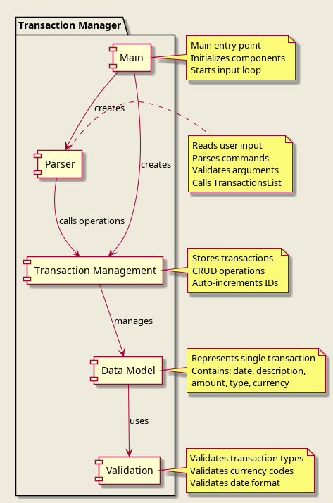
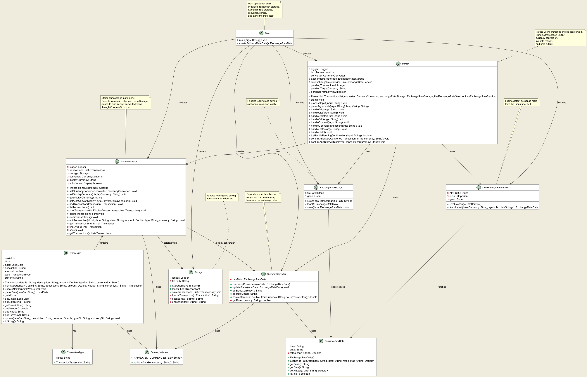

# Developer Guide

## Acknowledgements

This project is built on the Java platform and follows object-oriented design principles. The application structure is inspired by the individual project iP.

**Note**: The PlantUML diagram source files are located in the `docs/diagrams/` directory. To generate PNG images from the `.puml` files, use a PlantUML tool or online generator.

## Additional Notes
For JJ: modify the architecture below to add conversion

## Design & Implementation

### Architecture

The following architecture diagram provides a high-level view of the Transaction Manager system:



The Transaction Manager follows a layered architecture with the following main components:

1. **Main**: The entry point that initializes all components and starts the application loop.
2. **Parser**: * Handles **multi-step commands with pending state (confirm workflow)**
    - Maintains temporary state for confirmation-based workflows (e.g., currency conversion confirmation)
3. **TransactionsList**: Manages the collection of Transaction objects and provides CRUD operations.
4. **Transaction**: Represents individual financial transactions with validation and data integrity.
5. **Validators**: Utility classes (CurrencyValidator, TransactionType) that enforce business rules.
6. **Storage**: Handles persistence of transactions to local file storage.
7. **Currency Services**: Handles currency conversion and exchange rate management.
    - `CurrencyConverter`
    - `ExchangeRateData`
    - `ExchangeRateStorage`
    - `LiveExchangeRateService`
8. **Account System**: 'Account' handles hierarchial account parsing and filtering logic

The components interact as follows:
- `Duke` creates and initializes `Parser` and `TransactionsList`.
- `Parser` processes user commands and calls methods on `TransactionsList`.
- `TransactionsList` manages `Transaction` objects and uses validators for data integrity.
- `Transaction` objects encapsulate individual transaction data and validation logic.
- `Storage` reads from and writes to local files.
- `CurrencyConverter` performs currency conversion using exchange rate data.
- `ExchangeRateStorage` loads and saves exchange rate data locally.
- `LiveExchangeRateService` fetches real-time exchange rates from an external API.

### Design Considerations

**Transaction Storage**: Transactions are stored in an ArrayList for efficient random access and iteration. This design choice supports the application's requirement for fast listing and editing operations.

**Command Parsing**: The Parser uses simple string splitting and HashMap storage for command arguments, providing flexibility for future command extensions without complex parsing logic.

**Validation Separation**: Validation logic is separated into dedicated classes (CurrencyValidator, TransactionType) to follow the Single Responsibility Principle and enable easy testing and modification.

### Component-Level Design

#### Parser Component
The Parser component is responsible for:
- Reading user input from the console
- Parsing command strings into actionable operations
- Validating command syntax and arguments
- Delegating operations to the TransactionsList component
- Providing user feedback and error messages

#### Transaction Management Component
The TransactionsList component provides:
- Storage and management of Transaction objects using ArrayList
- Auto-incremented ID generation
- CRUD operations (add, list, edit, delete, clear)
- Data integrity maintenance
- Logging for debugging and monitoring

#### Model Components
The Transaction, TransactionType, CurrencyValidator, Posting and Account classes form the data model:
- **Transaction**: Represents a financial transaction with date, description, amount, type, and currency
- **TransactionType**: Validates and stores transaction type (debit/credit)
- **CurrencyValidator**: Validates currency codes against an approved list
- **Posting**: Represents a single entry transaction, containing an account and amount.
- **Account**: Encapsulates hierarchial account logic and validation


**Key Relationships**:
- `Duke` aggregates `Parser` and `TransactionsList`
- `Parser` uses `TransactionsList` for operations
- `TransactionsList` contains multiple `Transaction` objects
- `Transaction` uses `TransactionType` and `CurrencyValidator`
- All components use Java's built-in collections and utilities


## Implementation Details

### Transaction Flow
Implementer: Pran

The transaction flow manages the lifecycle of user financial records from user input down to persistent storage.

**CRUD Operations**
*   **Create (Add):** The `Parser` extracts transaction arguments (date, description, amount, type, currency) and instantiates a `Transaction` object. The `TransactionsList` adds this object to its in-memory list and immediately triggers a save.

*   **Read (List):** `TransactionsList` retrieves the list of transactions, sorts them chronologically by date, and displays them. It optionally collaborates with the `CurrencyConverter` to display amounts in a user-specified target currency without mutating the underlying data.

*   **Update (Edit):** Users can modify specific fields of an existing transaction using its auto-incremented ID. `TransactionsList` retrieves the target transaction and updates only the provided fields.

*   **Delete/Clear:** Individual transactions are removed by ID, or the entire list is cleared via `TransactionsList`. Both operations immediately trigger a save to storage.


**Transaction Data Model**
*   The `Transaction` class acts as the core entity. It contains an auto-incrementing integer ID, a `LocalDate` (enforced as DD/MM/YYYY), a description, a `double` amount, a `TransactionType` object, and a `String` currency.
*   Validation is strictly enforced upon instantiation:
    *   `TransactionType` restricts types to strictly "debit" or "credit".
    *   `CurrencyValidator` restricts currencies to an approved list ("SGD", "USD", "EUR").

---

### Design Decisions
*   **Fail-Fast Validation in Domain Entities:** Validation logic (e.g., checking for empty descriptions, valid date formats, valid currencies) is strictly enforced directly inside the `Transaction` constructor, `TransactionType`, and `CurrencyValidator`. 
    *   *Rationale:* This ensures that a `Transaction` object can never exist in an invalid state in memory. If bad data is passed, it fails immediately before being added to the list.
*   **Encapsulated Validation:** Validation logic for specific fields is separated into utility/wrapper classes (`TransactionType` and `CurrencyValidator`) rather than bloating the `Transaction` class itself.
*   **Wrapper Classes for Constrained Values:** Instead of keeping the transaction type as a raw string, it is wrapped in a `TransactionType` struct-like class.
    *   *Rationale:* It centralizes the string-matching logic (allowing case-insensitive checks for "debit" or "credit") and prevents typos from polluting the data model.
*   **Hierarchical Account Design:**
    *   *Rationale:*
        * Accounts are structured using `:` to support nested categorisation 
        * Enables scalable filtering and reporting 
        * Avoids ambiguity compared to flat string-based categories
---

### Alternatives Considered
**1. Input Parsing: Regex Flag Mapping vs. Fixed Position Arguments**
*   **Alternative:** Require users to enter data in a strict order separated by a delimiter (e.g., `add 18/03/2026 | Office supplies | 45.50 | debit | SGD`).
*   **Pros:** Much simpler to implement using a basic `String.split("\\|")`.
*   **Cons:** Highly error-prone for the user. If they forget the order or miss a delimiter, the application will parse the wrong fields.
*   **Decision:** The regex-based flag map (using `-desc`, etc.) was chosen to prioritize a flexible, forgiving user experience over implementation simplicity.

**2. Transaction Identifiers: Auto-incrementing Integer vs UUID**
*   **Alternative:** Assign a randomly generated UUID to each transaction instead of an auto-incrementing integer.
*   **Pros:** Eliminates the need to track the `nextId` state across application restarts and prevents ID collisions when merging files.
*   **Cons:** UUIDs are long, clunky, and highly inconvenient for users to type in a CLI environment when running `edit` or `delete` commands.
*   **Decision:** Auto-incrementing integers were selected to provide a user-friendly, concise CLI experience.

### Class Diagrams

The following class diagram shows the relationships between all components:



### Storage Feature
Implementer: JJ
The storage feature is responsible for persisting transaction data to local file storage and restoring it upon application startup.
---

#### 1. Transaction Persistence
The `Storage` class manages reading from and writing to a local text file (`ledger.txt`).
* Transactions are saved in a tab-separated format
* Each transaction includes ID, date, description, amount, type, and currency
* Data is written immediately after every modifying operation (add, edit, delete, clear)

This ensures:
* Data durability across application runs
* Minimal risk of data loss
---

#### 2. Loading Transactions
Upon application startup, `Storage` loads all previously saved transactions into memory.
* Reads file line-by-line
* Parses each line into a `Transaction` object
* Reconstructs transaction IDs and updates the auto-increment counter

Invalid or malformed lines are safely ignored to prevent crashes.
---

#### 3. Data Encoding and Decoding
To ensure file integrity, special characters are handled using escaping:
* `\t` for tabs
* `\n` for newlines
* `\\` for backslashes
  This prevents corruption of the file format when storing user input.
---

#### 4. Integration with TransactionsList
The `TransactionsList` component interacts directly with `Storage`:
* Calls `load()` during initialization
* Calls `save()` after every modification

This design ensures:
* Separation of concerns between data management and persistence
* Consistent synchronization between memory and disk
---

#### Design Considerations
* **Immediate Persistence**: Data is saved after every operation to prevent loss
* **Simple File Format**: Tab-delimited text allows easy debugging and readability
* **Robustness**: Invalid data is safely handled without crashing the application
* **Encapsulation**: Storage logic is isolated from business logic in `TransactionsList`

#### Sequence Diagram


The diagram above shows:
* `TransactionsList` triggering save operations
* `Storage` writing transaction data to file 
* Data being reloaded when the application starts
---

### Currency Conversion Feature
Implementer: JJ
The currency conversion feature extends the system by introducing dynamic currency handling, persistent exchange rate storage, and real-time rate retrieval.
---

#### Integration with Architecture
This feature introduces and integrates the following components:
* `CurrencyConverter`: Core conversion logic
* `ExchangeRateData`: Data model for exchange rates
* `ExchangeRateStorage`: Handles persistent storage of exchange rates
* `LiveExchangeRateService`: Fetches real-time exchange rates

These components are connected as follows:
* `Duke` initializes the converter and injects it into `Parser` and `TransactionsList`
* `Parser` handles `convert` and `rates` commands
* `TransactionsList` uses the converter for display-level conversions
* `ExchangeRateStorage` ensures exchange rates persist across application runs
---

#### 1. Simple Currency Conversion
The `CurrencyConverter` class provides the core conversion logic via the `convert()` method.
* Validates currencies using `CurrencyValidator`
* Converts via a base currency for consistency
* Handles same-currency conversion as a no-op
---

#### 2. Exchange Rate Storage
The `ExchangeRateStorage` component ensures exchange rate data is persisted locally.
* Loads exchange rates from a JSON file at application startup
* Saves updated rates after fetching from the API
* Ensures data validity before reading or writing

This allows the application to:
* Avoid repeated API calls
* Maintain functionality even without internet access
---

#### 3. Live Exchange Rate Integration
The `LiveExchangeRateService` fetches real-time exchange rates from an external API.
* Sends HTTP requests to retrieve latest rates
* Parses JSON responses into `ExchangeRateData`
* Updates local storage via `ExchangeRateStorage`
* Triggered using the `rates refresh` command

A fallback mechanism in `Duke` ensures the system remains functional if live data retrieval fails.
---

#### 4. Conversion of Stored Transactions
Stored transactions can be converted dynamically without modifying underlying data.
Implemented in:
* `Parser` (`convert transaction` command)
* `TransactionsList` (conversion during display)

Features:
* Converts a transaction by ID
* Uses latest available exchange rates
* Preserves original stored values
---

#### 5. Display Currency Conversion (List View)
Transactions can be displayed in a selected currency using:
```
list -to USD
```

* Uses `setDisplayCurrency()` and `setAutoConvertDisplay()`
* Conversion is applied during output rendering
* Does not overwrite stored transaction data
---

#### Design Considerations
* **Separation of Concerns**: Conversion, storage, and API handling are modularized
* **Persistence**: Exchange rates are stored locally to improve performance and reliability
* **Resilience**: Fallback data ensures continued functionality without API access

#### Sequence Diagram


The diagram above illustrates how user input flows through the system:
* `Parser` extracts and validates inputs
* `CurrencyValidator` ensures valid currencies
* `CurrencyConverter` performs the conversion 
* Results are displayed without modifying stored data
---


#### 6. Confirm and Store Converted Transactions
This feature extends the currency conversion system by allowing users to **persist converted values into storage**, 
instead of keeping them as view-only.
Previously, all conversion operations (`convert`, `convert transaction`, `list transaction -to`) were strictly **non-destructive**.
---

#### Implementation Details
This feature is implemented primarily in the `Parser` component through **stateful command handling**.

New internal state variables in `Parser`:

* `pendingTransactionId`: stores the transaction ID (for single conversion)
* `pendingTargetCurrency`: stores the selected target currency
* `pendingFromListView`: indicates whether the conversion came from list view
---

##### Workflow
##### Case 1: `convert transaction`
1. User runs:
   ```
   convert transaction 3 -to SGD
   ```
2. System:
    * Calculates converted value
    * Displays result
    * Stores pending state (ID + currency)
3. User enters:
   ```
   confirm
   ```
4. System:
    * Calls `TransactionsList.editTransaction(...)`
    * Updates:
        * amount
        * currency
    * Persists changes via `Storage.save()`
---

##### Case 2: `list -to`
1. User runs:
   ```
   list -to SGD
   ```
2. System:
    * Displays converted values (view-only)
    * Stores pending state (currency + list mode)
3. User options:
    * `confirm all` → update all transactions
    * `confirm ID` → update one transaction
4. System:
    * Iterates through transactions (if all)
    * Applies conversion
    * Persists via `Storage`

---

#### Design Considerations
* **Explicit Confirmation Required**
    * Prevents accidental data mutation
    * Maintains safety of original financial records
* **Stateful Parser Design**
    * Enables multi-step commands (view → confirm)
    * Avoids modifying core model classes
* **Reuse of Existing Logic**
    * Uses `editTransaction()` instead of creating new update methods
---

#### Sequence Diagram


### Documentation and User Experience Improvements
Implementer: Chingy

This contribution focuses on enhancing the user experience through comprehensive documentation and implementing the help system to make the application more accessible to new users.

---

#### 1. User Guide Rewrite and Enhancement
The User Guide was completely rewritten to provide comprehensive documentation for both new and experienced users.

**Key Improvements:**
* **Double-Entry Accounting Explanation**: Added beginner-friendly explanations of double-entry bookkeeping concepts including:
  * The accounting equation (Assets = Liabilities + Equity)
  * Debit vs. Credit fundamentals
  * How transactions work in Ledger67
  * Practical examples for different user scenarios

* **Currency Conversion Documentation**: Added detailed documentation for all currency-related features:
  * `convert` command for currency conversion
  * `convert transaction` command for converting existing transactions
  * `rates refresh` command for updating exchange rates
  * Complete examples and expected outputs

* **Command Reference Enhancement**: Updated the command summary table to include all new commands with clear formatting and examples.

* **FAQ Section**: Added frequently asked questions to address common user concerns about:
  * Data transfer between computers
  * Difference between debit and credit
  * Personal finance usage
  * Supported currencies
  * Double-entry system implementation

---

#### 2. Help Command Implementation
Implemented a comprehensive help system within the application to provide immediate assistance to users.

**Implementation Details:**
* **Parser Integration**: Added `handleHelp()` method to the `Parser` class
* **Command Structure**: Organized help output into logical sections:
  * Available commands with clear numbering
  * Format specifications for each command
  * Practical examples for each command
  * Additional information about data formats and constraints

* **User-Friendly Output**: The help command displays:
  * All 10 available commands with consistent formatting
  * Required and optional parameters for each command
  * Real-world usage examples
  * Important notes about data storage and exchange rates

**Technical Implementation:**
```java
private void handleHelp() {
    System.out.println("=== Ledger67 Help ===");
    System.out.println("Available commands:");
    // ... command documentation
}
```

---

#### 3. Documentation Maintenance and Currency Feature Updates
Ensured documentation stays current with evolving project features.

**Accomplishments:**
* **Real-time Updates**: Updated User Guide immediately after currency conversion features were merged
* **Command Consistency**: Verified help command output matches actual implemented commands
* **Build Integration**: Tested help functionality across different execution methods (Gradle run, JAR file)
* **Team Collaboration**: Committed and pushed documentation updates to ensure team synchronization

---

#### Design Considerations
* **Beginner-Friendly Approach**: Documentation written for users with no prior accounting knowledge
* **Progressive Disclosure**: Basic concepts explained first, followed by advanced features
* **Consistent Formatting**: All commands documented with the same structure for predictability
* **Practical Examples**: Real-world scenarios provided for each command
* **Accessibility**: Help available both in-app and via external documentation

---

#### Impact on User Experience
* **Reduced Learning Curve**: New users can understand the application faster
* **Immediate Assistance**: Users can get help without leaving the application
* **Comprehensive Reference**: All features are properly documented
* **Consistent Experience**: Documentation matches actual application behavior

### [Proposed] Improved Account Validation and Hierarchical Account Registry
Implementer: Pran

### [Proposed] Date and Regex Filtering Engineer
Implementer: ??

### [Proposed] Transaction Presets and UI Improvements
Implementer: ??

### Hierarchical Account Registry & Filtering Feature
Implementer: JJ

This feature allows users to filter transactions based on hierarchical account structures using the `list -acc` command.

---
#### Motivation

As the number of transactions grows, users need a way to quickly isolate transactions belonging to specific financial categories such as Assets, Expenses, or Income.
Hierarchical account structures (e.g., `Assets:Bank:DBS`) make simple string matching insufficient. Hence, a structured filtering mechanism was implemented.
---
#### Implementation
This feature is implemented across three main components:

1. **Parser**
    - Detects the `-acc` flag
    - Extracts the account filter string
    - Passes it to `TransactionsList`

2. **Account**
    - Parses hierarchical account names using `:`
    - Provides `isUnder(String parentAccount)` method
    - Supports prefix-based hierarchical matching

3. **TransactionsList**
    - Iterates through all transactions
    - Filters postings based on account hierarchy
    - Displays only matching transactions

---

#### Core Logic
The key method used is:
```java
public boolean isUnder(String parentAccount)

#### Sequence Diagram


## Appendix: Requirements

### Target User Profile

The Transaction Manager is designed for:

- **Individuals** who need to track personal financial transactions
- **Small business owners** who require simple expense tracking
- **Students** learning about financial management
- **Users comfortable with command-line interfaces**
- **Those who prefer typing over mouse interactions**
- **Users dealing with multiple currencies** who require quick and reliable currency conversion

### Value Proposition

The Transaction Manager solves several key problems:

1. **Simplified Financial Tracking**: Provides a straightforward way to record and manage financial transactions without complex accounting software.
2. **Rapid Data Entry**: Command-line interface allows for faster transaction entry compared to GUI applications for users comfortable with typing.
3. **Portability**: Lightweight Java application that runs on any platform with Java 17+ installed.
4. **Multi-Currency Support**: Enables users to convert between currencies and view transactions in different currencies without altering stored data.
5. **Live Exchange Rates Integration**: Allows users to refresh and use up-to-date exchange rates for more accurate conversions.

### User Stories

| Version | As a ... | I want to ...                              | So that I can ...                                                 |
|---------| -------- | ------------------------------------------ | ----------------------------------------------------------------- |
| v1.0    | new user | see usage instructions                     | refer to them when I forget how to use the application            |
| v1.0    | user     | add a new transaction                      | record my financial activities                                    |
| v1.0    | user     | list all transactions                      | view my transaction history                                       |
| v1.0    | user     | edit a transaction                         | correct mistakes in previously recorded transactions              |
| v1.0    | user     | delete a transaction                       | remove erroneous or duplicate entries                             |
| v1.0    | user     | have my transactions automatically saved   | avoid losing data between sessions                                |
| v1.0    | user     | load previously saved transactions         | continue tracking finances across sessions                        |
| v1.0    | user     | convert currencies                         | understand values across different currencies                     |
| v1.0    | user     | convert a transaction to another currency  | quickly view equivalent values without modifying stored data      |
| v1.0    | user     | view transactions in another currency      | compare spending consistently across currencies                   |
| v1.0    | user     | refresh exchange rates                     | ensure conversion uses up-to-date rates                           |
| v2.0    | user     | filter transactions by date                | review transactions from specific time periods                    |
| v2.0    | user     | search transactions by description         | find specific transactions quickly                                |
| v2.0    | user     | validate my transactions                   | ensure my double-entry accounts are balanced                      |
| v2.0    | user     | add new categories under each account type | filter by transaction easily and see where I am spending my money |
| v2.0    | user     | be able to categorise transactions         | filter by transaction type                                        |
| v2.0    | user     | generate balance sheet report              | get a detailed look into my assets                                |

### Non-Functional Requirements

1. **Reliability**
   - Application should not crash on invalid user input
   - Data should remain consistent during CRUD operations
   - Error messages should be helpful and actionable
   - Exchange rate data should be validated before use

3. **Usability**
   - Command syntax should be intuitive and consistent
   - Help text should be accessible via a help command
   - Error messages should clearly indicate what went wrong and how to fix it
   - Conversion commands should clearly distinguish between stored data and display-only values

3. **Maintainability**
   - Code should follow Java coding standards
   - Comprehensive unit tests should cover critical functionality
   - Code should be well-documented with JavaDoc comments
   - Separation of concerns should be maintained between components
    
## Glossary

* **Transaction**: A financial record containing date, description, amount, type (debit/credit), and currency.
* **Debit**: A transaction representing money leaving an account (expense, payment).
* **Credit**: A transaction representing money entering an account (income, deposit).
* **Currency Code**: Three-letter ISO currency code (SGD, USD, EUR).
* **Parser**: Component responsible for interpreting user commands and delegating to appropriate handlers.
* **TransactionsList**: Repository managing the collection of Transaction objects.
* **Validation**: Process of ensuring data meets predefined rules before processing.
* **Auto-increment ID**: Automatically generated unique identifier for each transaction.
* **CRUD Operations**: Create, Read, Update, Delete - the four basic operations of persistent storage.
