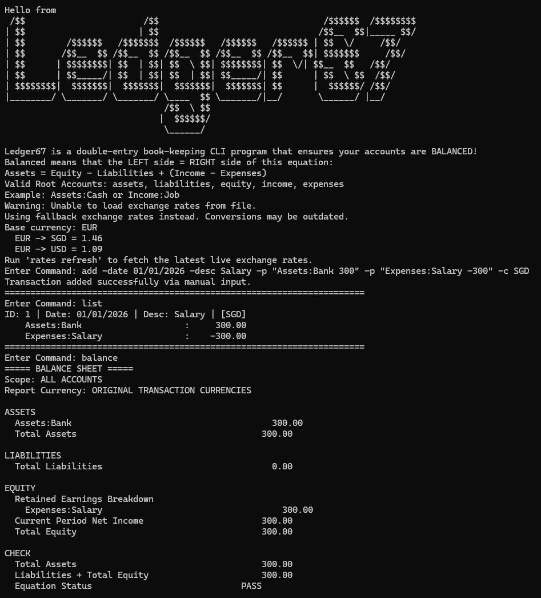

# Ledger67

Ledger67 is a command-line double-entry accounting system that allows users to manage financial transactions with proper accounting principles.

## Features
- Double-entry accounting
- Hierarchical accounts
- Currency conversion
- Confirmation workflow
- Balance sheet generation

## Screenshot

## User Guide
[View User Guide](./website_files/[CS2113-T09-4][Ledger67]UG.pdf)

## Developer Guide
[View Developer Guide](./website_files/[CS2113-T09-4][Ledger67]DG.pdf)

## The team
* [About Us & our PPPs](AboutUs.md)
