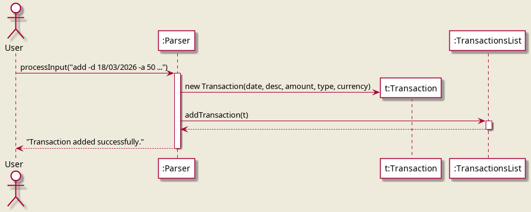
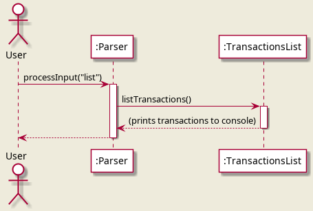
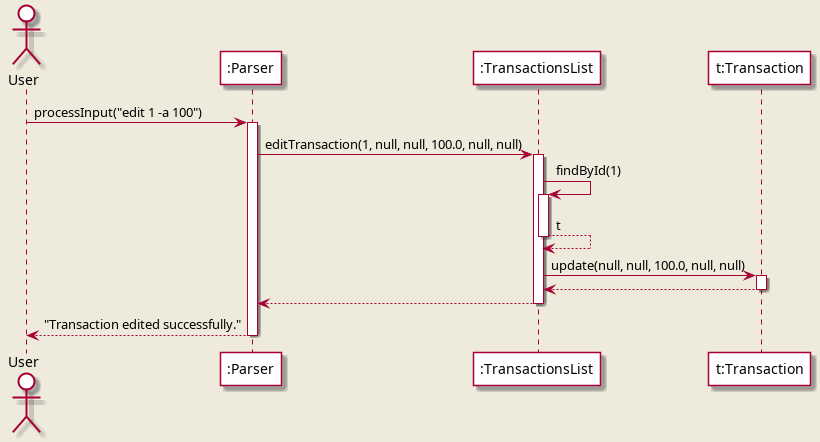
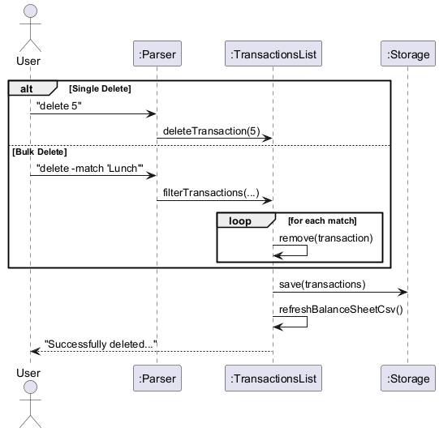
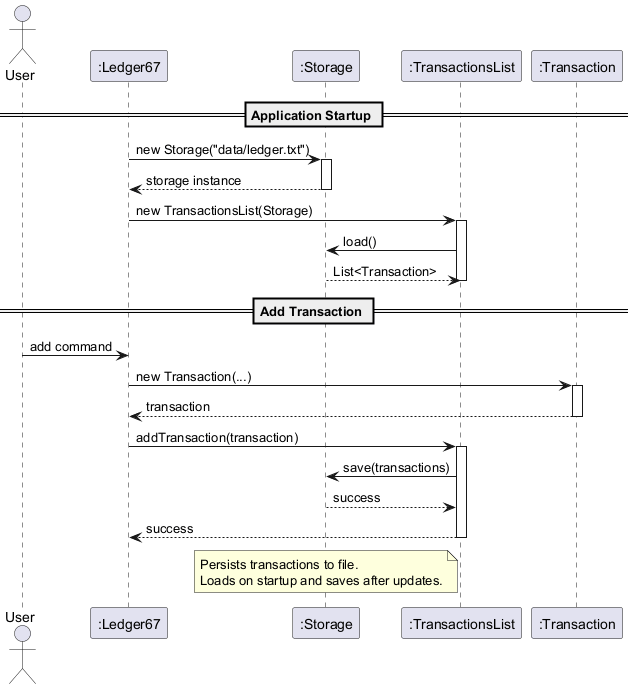
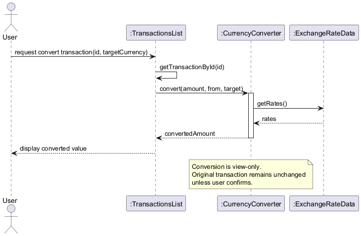
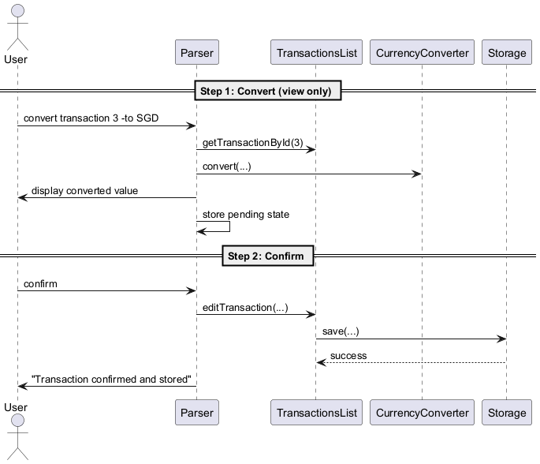
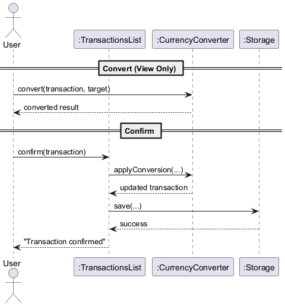

# Project Portfolio Page – JJ

## Overview

**Ledger67** is a command-line double-entry accounting system that helps users record and manage financial transactions while preserving proper accounting structure. It supports hierarchical accounts, multi-currency conversion, confirmation workflows, and balance sheet generation for financial analysis.

Beyond basic transaction tracking, Ledger67 supports hierarchical accounts, multi-currency conversion, confirmation workflows, and real-time balance sheet generation for financial analysis.
My main contributions focused on the system’s core accounting and infrastructure features, particularly the **balance sheet**, **currency conversion and confirmation workflow**, **hierarchical account support**, **storage**, and the corresponding **documentation and testing updates** required to keep the product consistent after post-PE review fixes.
As a 2 person (third person not responsive) team, we were able to work well together to complete the product to the best of our ability after sleepless nights and countless checks.

---

## Summary of Contributions

### Code Contributed
[View my code contributions](<https://nus-cs2113-ay2526-s2.github.io/tp-dashboard/?search=yeejj&breakdown=true&sort=groupTitle%20dsc&sortWithin=title&since=2026-02-20T00%3A00%3A00&timeframe=commit&mergegroup=&groupSelect=groupByRepos&checkedFileTypes=docs~functional-code~test-code~other&filteredFileName=>)

---

### Enhancements Implemented

#### 1. Balance Sheet Feature (Major Feature)

I implemented the **balance sheet generation feature**, which allows users to view a structured summary of their financial position directly from the CLI.

**What I added**
- Implemented `balance`
- Added filtering support with `balance -acc`
- Added converted reporting with `balance -to`
- Added combined usage with `balance -acc ACCOUNT -to CURRENCY`
- Designed and implemented a dedicated `BalanceSheet` class for:
    - balance sheet formatting
    - equation checking
    - CSV export to `data/balance-sheet.csv`

**Why this was substantial**
- It required aggregation across all transactions and postings instead of simple line-by-line printing
- It required correctly folding **Income** and **Expenses** into **Equity**
- It needed to work with **hierarchical accounts**
- It had to support both **original-currency** and **converted-currency** views
- It required output both in CLI format and in CSV export format

**Files involved**
- `BalanceSheet`
- `TransactionsList`
- `Parser`
- `Account`

---

#### 2. Currency Conversion System (Major Feature)

I implemented the project’s **currency conversion subsystem**, which supports both standalone conversion and view-mode conversion of stored transactions.

**What I added**
- `CurrencyConverter`
- `ExchangeRateData`
- `ExchangeRateStorage`
- `LiveExchangeRateService`
- Support for:
    - `convert`
    - `convert transaction`
    - `list -to`
    - `rates refresh`

**Design decisions**
- Conversion is **non-destructive by default**
- Exchange rates can be loaded from local storage
- Live rates can be refreshed from an API
- Stored transaction values remain unchanged unless explicitly confirmed

**Why this was substantial**
- It introduced an additional subsystem that interacts with both the parser and transaction rendering flow
- It required data persistence for exchange rates
- It required handling both offline and refreshed exchange rate usage
- It had to integrate cleanly with later features such as `confirm` and `balance -to`

---

#### 3. Confirm Conversion Workflow (Multi-step Feature)

I designed and implemented the **stateful confirmation workflow** for converted transactions.

**What I added**
- `confirm`
- `confirm all`
- `confirm ID`

**How it works**
- After `convert transaction`, users may `confirm`
- After `list -to`, users may `confirm all` or `confirm ID`
- The parser temporarily stores:
    - pending transaction ID
    - pending target currency
    - whether the workflow came from converted list view
    - displayed transaction IDs for validation

**Why this was substantial**
- It required **stateful parser logic**, rather than one-shot command parsing
- It had to safely distinguish between **view-only** and **persisted** operations
- It reused existing editing logic to avoid duplicating persistence code
- It needed careful validation so that invalid confirmation commands do not silently mutate data

---

#### 4. Hierarchical Account System (Core Feature)

I implemented the **hierarchical account model** and filtering support that allows the system to work with account trees such as `Assets:Bank:DBS`.

**What I added**
- Implemented the `Account` class
- Added validation of account roots
- Added support for hierarchical matching through `isUnder()`
- Integrated account hierarchy into:
    - `list -acc`
    - `balance -acc`

**Why this mattered**
- It allowed Ledger67 to support structured accounting categories rather than flat strings
- It made both reporting and filtering much more useful
- It was foundational for later features such as balance sheet grouping

---

#### 5. Storage System (Core Feature)

I implemented the project’s **transaction persistence layer**.

**What I added**
- `Storage`
- Save/load support for transactions
- Immediate persistence after modifying operations
- Robust parsing for storage recovery
- Escaping/unescaping support for special characters in stored text

**Why this was substantial**
- It turned the system from a session-only CLI into a usable persistent application
- It had to serialize and restore **multi-posting transactions**
- It needed to tolerate malformed storage lines without crashing the application

---

#### 6. Parser Enhancements and Feature Integration

Many of the features above required extending the `Parser` substantially.

**What I contributed**
- Added support for:
    - `balance`
    - `convert transaction`
    - `confirm`
    - `confirm all`
    - `confirm ID`
    - `rates refresh`
- Extended parser handling for:
    - `-acc`
    - `-to`
    - multi-step workflows
- Helped integrate feature-specific flows into a single consistent command system

**Why this mattered**
- The parser became the integration point for several major features
- These additions required both command dispatch logic and validation paths
- The confirmation feature in particular required careful coordination with transaction rendering and editing

---

#### 7. Post-PE-D Review Bug Fixes and Refinements

After the PE-D reviews, I handled a large set of **feature-related fixes and documentation consistency fixes**, especially in the areas I implemented.
Closed a total of 30 bugs after the PE-D to ensure all bugs are resolved. 

**Examples of fixes I contributed**
- Fixing Edit command to ensure minimum of 2 postings
- Handled Corrupted Storage File
- Rates Refresh warning
- ID increment error fixed
- Case Sensitivity Fix for root accounts 
- Duplicate flags fix
- Whitespace trimming bug
- Zero-amount transaction error
- fixed confirm transaction feature
- Decimal Rounding Documentation
- Updated the UG and DG structure, including:
    - adding a **Table of Contents** to both
    - reordering sections for easier navigation
- Fixed and clarified **User Guide / Developer Guide consistency**
- Added the missing **Developer Guide Appendix E: Instructions for Manual Testing**
- Fixed and simplified several UML diagrams
- Added new class diagrams where structural explanation was more suitable than sequence diagrams
- Resolved documentation bugs and feature-related bugs raised during review, especially around:
    - currency conversion workflows
    - confirmation workflow
    - balance sheet documentation
    - command format consistency
    - accounting equation consistency
    - storage and diagram explanations

This work was important because it improved not just correctness, but also the usability and maintainability of the final product.

---

#### 8. Testing
- I added and updated tests for the features I implemented and for later fixes that affected earlier behaviour.
- Created **JUnit tests for all implemented features**

**What I did**
- Added JUnit tests for major features and related logic to improve test coverage
- Updated existing tests after implementation changes and bug fixes
- Helped maintain compatibility after parser and account-related changes
- Contributed to improving test reliability after the later case-sensitivity and behavior fixes

**Examples of relevant test areas**
- parser workflows
- transactions list behaviour
- storage persistence
- exchange-rate storage and conversion
- balance sheet behaviour
- confirmation workflow

---

### Contributions to the User Guide

I contributed to the documentation for the features I implemented and later helped fix documentation issues found during review.

**Sections and improvements contributed**
- Balance sheet feature documentation
- Currency conversion workflow documentation
- Confirm workflow documentation
- Hierarchical account filtering documentation
- Command summary consistency updates
- Table of Contents and document reordering for readability
- Post-review fixes to ensure the UG matched the final implementation

I also fixed several documentation bugs after the PE-D reviews, including feature-related inconsistencies and command-format mismatches.

---

### Contributions to the Developer Guide

I wrote and updated DG sections related to the features I implemented, and later improved the DG structure after reviewer feedback.

**Sections contributed**
- Storage Feature
- Currency Conversion Feature
- Confirm Conversion Workflow
- Balance Sheet Feature
- Hierarchical account-related explanations

**Documentation improvements contributed**
- Added the required **Appendix E: Instructions for Manual Testing**
- Added and revised UML diagrams
- Updated sequence diagrams to follow expected conventions more closely
- Added new **class diagrams** where they explained component/package structure better than sequence diagrams
- Added Table of Contents and improved section ordering
- Fixed post-review issues in DG content and diagram structure

**Diagrams contributed or updated**
- Storage-related diagrams
- Currency conversion diagrams
- Confirm workflow diagrams
- Balance sheet-related diagram/documentation updates
- New class diagrams for clearer structural explanation
- Simplified all sequence diagrams such that are visible

---

### Contributions to Team-Based Tasks

I contributed to team coordination and project maintenance by:
- creating and managing issues
- helping maintain milestones aligned with project deadlines
- discussing implementation sequencing for features
- coordinating integration of documentation and diagrams with ongoing code changes
- Working closely with Pran to ensure we do not fall behind schedule as the other teammate remained unresponsive, this was the biggest struggle of the project.
- Completed the AboutUs.md page and launched the product website.
- Released the final versions v1.0, v2.0 and v2.1 with the appropriate UG and DG, for the team to ensure everything is complete 

I also worked with teammates during integration so that the implemented features and documentation stayed aligned across releases.

---

### Review / Mentoring Contributions

I reviewed feature-related bugs and discussed fixes with teammates, especially where the implemented features interacted with each other.

My contributions included:
- discussing and debugging integration issues
- checking consistency between code, UG, and DG
- helping identify where documentation no longer matched implementation
- helping refine feature flows and design decisions through discussion
- Especially for the UML diagrams, helped teammates to ensure proper implementation.

---

### Contributions Beyond the Project Team

Beyond direct coding, I helped keep the project coherent by:
- improving documentation quality and consistency across UG and DG
- helping drive discussion around feature design and integration
- ensuring post-review fixes were reflected not only in code but also in diagrams and developer-facing documentation
- contributing to the team’s technical direction in areas such as:
    - system integration
    - documentation structure
    - diagram usage and cleanup
  
In terms of helping others:
- Contributed to a total of 14 bugs in the PE-D, putting in a deep genuine effort to help other's projects.

---

## Contributions to the Developer Guide (Extracts) - Non-exhaustive

## Table of Contents

### 3.1 Transaction Flow
**Implementer: Pran, JJ**

The transaction flow manages the lifecycle of financial records, ensuring that every entry satisfies the fundamental accounting equation before being persisted.

#### 3.1.1 Create (Add) Flow
The addition process supports two paths: **Manual Entry** (providing specific postings) or **Preset Entry** (using templates).
*   **Input**: If `isUiAssistOn` is true, the `UiAssistFactory` interactively prompts the user for fields. Otherwise, the `Parser` extracts flags directly.
*   **Processing**:
    *   If a `-preset` is used, the `PresetHandler` generates a `List<Posting>` (e.g., swapping Assets for Expenses).
    *   The `Parser` validates the currency and date format.
    *   The `Transaction` object is instantiated and must pass an `isBalanced()` check (Sum of postings ≈ 0).
*   **Finalization**: `TransactionsList` appends the transaction, triggers `Storage` to save, and refreshes the background `balance-sheet.csv`.



#### 3.1.2 Read (List/Filter) Flow
Listing is non-destructive and supports layered filtering.
*   **Filtering**: `TransactionsList` applies filters in sequence: Date Range → Regex Match → Account Hierarchy (e.g., filtering for `Assets` includes `Assets:Cash`).
*   **View-Only Conversion**: If the `-to` flag is present, the `Parser` sets a **Pending State**. The `TransactionsList` renders the converted values for preview but does not modify the underlying data unless a `confirm` command follows.



#### 3.1.3 Update (Edit) Flow
Updates allow modifying any part of an existing transaction while enforcing re-validation.
*   **Lookup**: `TransactionsList` retrieves the transaction by ID.
*   **Modification**: The `Transaction.update()` method selectively replaces fields (Date, Desc, Currency, or Postings).
*   **Validation**: If postings are updated, the `isBalanced()` check is re-run. If the new set is unbalanced, the update is aborted.



#### 3.1.4 Delete Flow (Single & Bulk)
Deletion supports targeted removal or mass-clearing based on filters.
*   **Single**: Deletes a specific transaction by its unique ID.
*   **Bulk**: Uses the same filtering engine as the `list` command to identify a sub-set of transactions for removal.
*   **Safety**: Bulk deletion requires at least one filter flag to prevent accidental total wipes (users must use `clear` for that).



---

### 3.3 Storage Feature

Implementer: JJ
The storage feature is responsible for persisting transaction data to local file storage and restoring it upon application startup.

---

#### 3.3.1 Transaction Persistence
The `Storage` class manages reading from and writing to a local text file (`ledger.txt`).
* Transactions are saved in a tab-separated format
* Each transaction includes ID, date, description, amount, type, and currency
* Data is written immediately after every modifying operation (add, edit, delete, clear)

This ensures:
* Data durability across application runs
* Minimal risk of data loss

---

#### 3.3.2 Loading Transactions
Upon application startup, `Storage` loads all previously saved transactions into memory.
* Reads file line-by-line
* Parses each line into a `Transaction` object
* Reconstructs transaction IDs and updates the auto-increment counter
* Invalid or malformed lines are safely skipped to prevent crashes.

---

#### 3.3.3 Data Encoding and Decoding
To ensure file integrity, special characters are handled using escaping:
* `\t` for tabs
* `\n` for newlines
* `\\` for backslashes
  This prevents corruption of the file format when storing user input.

---

#### 3.3.4 Integration with TransactionsList
The `TransactionsList` component interacts directly with `Storage`:
* Calls `load()` during initialization
* Calls `save()` after every modification

This design ensures:
* Separation of concerns between data management and persistence
* Consistent synchronization between memory and disk

---

#### 3.3.5 Design Considerations
* **Immediate Persistence**: Data is saved after every operation to prevent loss
* **Simple File Format**: Tab-delimited text allows easy debugging and readability
* **Robustness**: Invalid data is safely handled without crashing the application
* **Encapsulation**: Storage logic is isolated from business logic in `TransactionsList`

#### 3.3.6 Sequence Diagram


The diagram above shows:
* `TransactionsList` triggering save operations
* `Storage` writing transaction data to file
* Data being reloaded when the application starts

---

### 3.4 Currency Conversion Feature

Implementer: JJ

The currency conversion feature extends the system by introducing dynamic currency handling, persistent exchange rate storage, and real-time rate retrieval.

---

#### 3.4.1 Integration with Architecture
This feature introduces and integrates the following components:
* `CurrencyConverter`: Core conversion logic
* `ExchangeRateData`: Data model for exchange rates
* `ExchangeRateStorage`: Handles persistent storage of exchange rates
* `LiveExchangeRateService`: Fetches real-time exchange rates

These components are connected as follows:
* `Ledger67` initializes the converter and injects it into `Parser` and `TransactionsList`
* `Parser` handles `convert` and `rates` commands
* `TransactionsList` uses the converter for display-level conversions
* `ExchangeRateStorage` ensures exchange rates persist across application runs

---

#### 3.4.2 Simple Currency Conversion
The `CurrencyConverter` class provides the core conversion logic via the `convert()` method.
* Validates currencies using `CurrencyValidator`
* Converts via a base currency for consistency
* Handles same-currency conversion as a no-op

---

#### 3.4.3 Exchange Rate Storage
The `ExchangeRateStorage` component ensures exchange rate data is persisted locally.
* Loads exchange rates from a JSON file at application startup
* Saves updated rates after fetching from the API
* Ensures data validity before reading or writing

This allows the application to:
* Avoid repeated API calls
* Maintain functionality even without internet access

---

#### 3.4.4 Live Exchange Rate Integration
The `LiveExchangeRateService` fetches real-time exchange rates from an external API.
* Sends HTTP requests to retrieve latest rates
* Parses JSON responses into `ExchangeRateData`
* Updates local storage via `ExchangeRateStorage`
* Triggered using the `rates refresh` command

A fallback mechanism in `Duke` ensures the system remains functional if live data retrieval fails.

---

#### 3.4.5 Conversion of Stored Transactions
Stored transactions can be converted dynamically without modifying underlying data.
Implemented in:
* `Parser` (`convert transaction` command)
* `TransactionsList` (conversion during display)

Features:
* Converts a transaction by ID
* Uses latest available exchange rates
* Preserves original stored values

---

#### 3.4.6 Display Currency Conversion (List View)
Transactions can be displayed in a selected currency using:
```
list -to USD
```

* Uses `setDisplayCurrency()` and `setAutoConvertDisplay()`
* Conversion is applied during output rendering
* Does not overwrite stored transaction data

---

#### 3.4.7 Design Considerations
* **Separation of Concerns**: Conversion, storage, and API handling are modularized
* **Persistence**: Exchange rates are stored locally to improve performance and reliability
* **Resilience**: Fallback data ensures continued functionality without API access

#### 3.4.8 Sequence Diagram


The diagram above illustrates how user input flows through the system:
* `Parser` extracts and validates inputs
* `CurrencyValidator` ensures valid currencies
* `CurrencyConverter` performs the conversion
* Results are displayed without modifying stored data

---


### 3.5 Confirm and Store Converted Transactions

This feature extends the currency conversion system by allowing users to **persist converted values into storage**,
instead of keeping them as view-only.
Previously, all conversion operations (`convert`, `convert transaction`, `list transaction -to`) were strictly **non-destructive**.

---

#### 3.5.1 Implementation Details
This feature is implemented primarily in the `Parser` component through **stateful command handling**.

New internal state variables in `Parser`:

* `pendingTransactionId`: stores the transaction ID (for single conversion)
* `pendingTargetCurrency`: stores the selected target currency
* `pendingFromListView`: indicates whether the conversion came from list view

#### 3.5.2 Workflow
##### Case 1: `convert transaction`
1. User runs:
   ```
   convert transaction 3 -to SGD
   ```
2. System:
    * Calculates converted value
    * Displays result
    * Stores pending state (ID + currency)
3. User enters:
   ```
   confirm
   ```
4. System:
    * Calls `TransactionsList.editTransaction(...)`
    * Updates:
        * amount
        * currency
    * Persists changes via `Storage.save()`

---

##### Case 2: `list -to`
1. User runs:
   ```
   list -to SGD
   ```
2. System:
    * Displays converted values (view-only)
    * Stores pending state (currency + list mode)
3. User options:
    * `confirm all` → update all transactions
    * `confirm ID` → update one transaction
4. System:
    * Iterates through transactions (if all)
    * Applies conversion
    * Persists via `Storage`

---

#### 3.5.3 Design Considerations
* **Explicit Confirmation Required**
    * Prevents accidental data mutation
    * Maintains safety of original financial records
* **Stateful Parser Design**
    * Enables multi-step commands (view → confirm)
    * Avoids modifying core model classes
* **Reuse of Existing Logic**
    * Uses `editTransaction()` instead of creating new update methods

---

#### 3.5.4 Sequence Diagram


### 3.7 Balance Sheet Feature
Implementer: JJ

The Balance Sheet feature allows users to generate a real-time summary of their financial position based on the accounting equation:

```
Assets = Liabilities + Equity

Where Equity is affected by Income and Expenses:
Equity = Initial Equity + (Income - Expenses)
```

It aggregates all transactions and computes totals across hierarchical account categories.

---

#### 3.7.1 Integration with Architecture

This feature primarily extends:

- `Parser` → parses `balance` commands
- `TransactionsList` → computes aggregated values
- `Account` → supports hierarchical filtering
- `CurrencyConverter` → enables optional currency conversion

New component:
- `BalanceSheet` → handles formatting and export logic

---

#### 3.7.2 Command Handling

The `Parser` handles the following command formats:
```
balance
balance -acc ACCOUNT
balance -to TARGET_CURRENCY
balance -acc ACCOUNT -to TARGET_CURRENCY
````

The parser:
- extracts optional flags (`-acc`, `-to`)
- passes parameters to `TransactionsList.printBalanceSheet(...)`

---

#### 3.7.3 Balance Aggregation Logic
Implemented in `TransactionsList`:
```
private Map<String, Double> buildBalanceSheetTotals(...)
````

##### 3.7.4 Workflow:

1. Iterate through all transactions
2. Iterate through all postings
3. Apply account filtering:

    * Uses `Account.isUnder(accountPrefix)`
4. Apply currency conversion (if enabled)
5. Aggregate totals into a `Map<String, Double>`

---
#### 3.7.5 Hierarchical Account Support

The feature leverages:
```
account.isUnder("Assets:Bank")
```

This enables:

* parent-level aggregation (`Assets`)
* sub-account filtering (`Assets:Bank:DBS`)

---

#### 3.7.6 Income and Expense Handling

Income and Expenses are incorporated into Equity:

```
Net Income = Income - Expenses
```
Implementation:

* Income accounts increase equity
* Expense accounts reduce equity
* Computed dynamically during balance generation

This ensures:

```
Assets = Liabilities + Equity
```

---

#### 3.7.7 Currency Conversion

If `-to` is specified:

* Each posting is converted using `CurrencyConverter`
* Conversion is applied **during aggregation only**
* Stored data remains unchanged

---

#### 3.7.8 Output Formatting

Handled by the `BalanceSheet` class:

* Groups accounts into:

    * Assets
    * Liabilities
    * Equity
* Displays:

    * sub-accounts
    * totals
    * accounting check

---

#### 3.7.9 CSV Export

Each execution of `balance` triggers:
```
balanceSheet.exportToCsv("data/balance-sheet.csv");
```

##### 3.7.10 File Characteristics:

* Overwrites existing file
* Contains:

    * account names
    * balances
    * report currency

---

#### 3.7.11 Design Considerations
**1. Separation of Concerns**
* Aggregation → `TransactionsList`
* Presentation → `BalanceSheet`

**2. Non-Destructive Operations**
* Conversion is view-only
* No mutation of stored transactions

**3. Reuse of Existing Structures**
* Uses `Posting`, `Account`, `CurrencyConverter`
* Avoids duplicating logic

**4. Hierarchical Scalability**
* Supports deep account nesting without redesign

---

#### 3.7.12 Limitations

* Filtered views (`-acc`) may not balance fully
* Mixed currencies require `-to` for meaningful totals
* CSV export is overwrite-only (no versioning)

---

###  3.9 Hierarchical Account Registry & Filtering Feature
Implementer: JJ

This feature allows users to filter transactions based on hierarchical account structures using the `list -acc` command.

---
#### 3.9.1 Motivation

As the number of transactions grows, users need a way to quickly isolate transactions belonging to specific financial categories such as Assets, Expenses, or Income.
Hierarchical account structures (e.g., `Assets:Bank:DBS`) make simple string matching insufficient. Hence, a structured filtering mechanism was implemented.

---
#### 3.9.2 Implementation
This feature is implemented across three main components:

1. **Parser**
    - Detects the `-acc` flag
    - Extracts the account filter string
    - Passes it to `TransactionsList`

2. **Account**
    - Parses hierarchical account names using `:`
    - Provides `isUnder(String parentAccount)` method
    - Supports prefix-based hierarchical matching

3. **TransactionsList**
    - Iterates through all transactions
    - Filters postings based on account hierarchy
    - Displays only matching transactions

---

#### 3.9.3 Core Logic
The key method used is:

public boolean isUnder(String parentAccount)

#### 3.9.4 Sequence Diagram


## 4. Appendix A: Product Scope

### 4.1 Target User Profile

Ledger67 is designed for:

- Individuals who want to track personal financial transactions
- Small business owners who require simple expense tracking
- Students learning about financial management and accounting
- Users comfortable with command-line interfaces
- Users who prefer typing over graphical interfaces
- Users dealing with multiple currencies who require quick and reliable currency conversion

---

### 4.2 Value Proposition

Ledger67 addresses several key needs:

1. **Simplified Financial Tracking**  
   Provides a structured way to record and manage financial transactions using double-entry bookkeeping.

2. **Rapid Data Entry**  
   Command-line interface enables faster input for users familiar with typing workflows.

3. **Portability**  
   Lightweight Java application that runs on any system with Java 17+.

4. **Multi-Currency Support**  
   Allows users to convert and view transactions across currencies without modifying stored data.

5. **Live Exchange Rate Integration**  
   Supports real-time rate updates for more accurate financial comparisons.

---

## 5. Appendix B: User Stories

| Version | As a ... | I want to ...                              | So that I can ...                                            |
|---------|----------|--------------------------------------------|--------------------------------------------------------------|
| v1.0    | new user | see usage instructions                     | refer to them when I forget how to use the application       |
| v1.0    | user     | add a new transaction                      | record my financial activities                               |
| v1.0    | user     | list all transactions                      | view my transaction history                                  |
| v1.0    | user     | edit a transaction                         | correct mistakes in previously recorded transactions         |
| v1.0    | user     | delete a transaction                       | remove erroneous or duplicate entries                        |
| v1.0    | user     | have my transactions automatically saved   | avoid losing data between sessions                           |
| v1.0    | user     | load previously saved transactions         | continue tracking finances across sessions                   |
| v1.0    | user     | convert currencies                         | understand values across different currencies                |
| v1.0    | user     | convert a transaction to another currency  | quickly view equivalent values without modifying stored data |
| v1.0    | user     | view transactions in another currency      | compare spending consistently across currencies              |
| v1.0    | user     | refresh exchange rates                     | ensure conversion uses up-to-date rates                      |
| v2.0    | user     | filter transactions by date                | review transactions from specific time periods               |
| v2.0    | user     | search transactions by description         | find specific transactions quickly                           |
| v2.0    | user     | validate my transactions                   | ensure my double-entry accounts are balanced                 |
| v2.0    | user     | add new categories under each account type | better organize financial data                               |
| v2.0    | user     | categorise transactions                    | filter by transaction type                                   |
| v2.0    | user     | generate balance sheet                     | understand financial position                                |
| v2.0    | user     | export balance sheet                       | analyse data externally                                      |
| v2.0    | user     | filter balance sheet by account            | focus on specific categories                                 |

---


## 6. Appendix C: Non-Functional Requirements

### 6.1 Reliability
- The application should not crash on invalid user input
- Data should remain consistent during all CRUD operations
- Error messages should be informative and actionable
- Exchange rate data should be validated before use

### 6.2 Usability
- Command syntax should be intuitive and consistent
- Help text should be accessible via a help command
- Error messages should clearly indicate what went wrong and how to fix it
- Conversion commands should clearly distinguish between stored data and display-only values

### 6.3 Maintainability
- Code should follow Java coding standards
- Critical functionality should be covered by unit tests
- Code should include meaningful documentation and comments
- Separation of concerns should be maintained across components

---

## 7. Appendix D: Glossary

- **Transaction**: A financial record containing a date, description, currency, and a list of postings that together form a balanced entry.
- **Posting**: A single entry linking an account to a numerical amount within a transaction.
- **Account**: A category used to classify financial data (e.g., Assets, Expenses, Income), supporting hierarchical structures.
- **Double-Entry Accounting**: An accounting method where every transaction affects at least two accounts and must balance.
- **Currency Code**: Three-letter ISO currency code (SGD, USD, EUR).
- **Parser**: Component responsible for interpreting user commands and delegating execution.
- **TransactionsList**: Component managing all transaction objects and performing filtering, updates, and aggregation.
- **Validation**: Ensuring that user inputs meet required constraints before processing.
- **Auto-increment ID**: Unique identifier automatically assigned to each transaction.
- **CRUD Operations**: Create, Read, Update, Delete operations for managing data.
- **Balance Sheet**: A financial statement summarizing Assets, Liabilities, and Equity.

---

## 8. Appendix E: Instructions for Manual Testing

This section provides guidance for testers to validate the key features of Ledger67.  
It complements the User Guide by outlining important test flows and edge cases.

---

### 8.1 Launching the Application

**Preconditions:**
- Java 17 or above is installed
- Application is compiled or JAR file is available

**Steps:**
1. Navigate to the project directory
2. Run:

```
java -jar tp.jar
```

or

```
./gradlew run
```

---

### 8.2 Adding Transactions

**Test basic add:**

```
add -date 01/01/2026 -desc "Lunch" -p "Assets:Cash -10" -p "Expenses:Food 10" -c SGD
```

**Expected:**
- Transaction is added successfully
- `list` shows the new transaction

---

### 8.3 Validation of Minimum Postings

**Test invalid case:**

```
add -date 01/01/2026 -desc "Invalid" -p "Assets:Cash 10" -c SGD
```

**Expected:**
- Error indicating at least 2 postings required
- Transaction is NOT added

---

### 8.4 Listing and Filtering

```
list
list -acc Expenses
list -match Lunch
list -begin 01/01/2026 -end 31/12/2026
```

**Expected:**
- Filters are applied correctly
- No data is modified

---

### 8.5 Editing Transactions

**Valid edit:**

```
edit 1 -desc "Updated Lunch"
```

**Invalid edit (1 posting):**

```
edit 1 -p "Assets:Cash -20"
```

**Expected:**
- Valid edit succeeds
- Invalid edit is rejected
- Original transaction remains unchanged

---

### 8.6 Deleting Transactions

```
delete 1
delete -match Lunch
```

**Expected:**
- Correct transactions are removed
- Bulk delete requires at least one filter

---

### 8.7 Currency Conversion

```
convert -a 100 -from USD -to SGD
convert transaction 1 -to SGD
```

**Expected:**
- Conversion is displayed
- Stored values remain unchanged until confirmed

---

### 8.8 Confirm Feature

```
convert transaction 1 -to SGD
confirm
```

**Expected:**
- Transaction is updated permanently
- Currency and values are changed

---

### 8.9 List Conversion (View Only)

```
list -to USD
```

**Expected:**
- Converted values displayed
- Original data remains unchanged

---

### 8.10 Balance Sheet

```
balance
balance -acc Assets
balance -to USD
```

**Expected:**
- Aggregated totals displayed
- Equation check shown
- Filtered view may not balance

---

### 8.11 Monetary Precision (Rounding)

```
add -date 01/01/2026 -desc "Precision Test" -p "Assets:Cash 100.999999" -p "Expenses:Food -100.999999" -c SGD
```

**Expected:**
- Values are stored as 2 decimal places
- Example: 100.999999 → 101.00

---

### 8.12 UI Assist Mode

```
uiassist -on
add
```

**Expected:**
- Prompts guide input step-by-step
- Resulting transaction is valid

---

### 8.13 Edge Cases

Test the following:

- Invalid date format
- Invalid currency
- Unbalanced transactions
- Duplicate flags
- Empty input

**Expected:**
- System rejects invalid input gracefully
- No crash occurs

---

### 8.14 Notes for Testers

- Stored data is persisted automatically after each modification
- Conversion features are **non-destructive** unless confirmed
- Filtering operations do not modify stored data  

## Contributions to the User Guide (Extracts) - Non-Exhaustive

### Table of Contents

### 3.3 Sign Convention
Ledger67 uses a **signed amount model** instead of debit/credit.
* `+` indicates an **increase**
* `-` indicates a **decrease**

#### Recommended Usage

| Account Type                | Increase | Decrease |
|-----------------------------|----------|----------|
| Assets, Expenses            | `+`      | `-`      |
| Liabilities, Equity, Income | `-`      | `+`      |

#### Note
Ledger67 only checks that transactions are **balanced**, and does not enforce sign conventions.
Users are encouraged to follow the recommended usage for consistency.

### 3.4 Monetary Precision
Ledger67 stores monetary values using **2 decimal places**, which is standard for currency amounts.

If users enter values with more than 2 decimal places, Ledger67 will round them before storing them.

Examples:
- `100.999999` is stored as `101.00`
- `50.1` is stored as `50.10`
- `75.555` is stored as `75.56`

Users should therefore avoid entering excessive decimal precision if exact sub-cent values are important.

### 4.3 Listing and Filtering Transactions: `list`
Displays recorded transactions. You can view all transactions or use filters to narrow down the results by date, account, keyword, or currency.

**Format**: `list [-acc ACCOUNT] [-begin DATE] [-end DATE] [-match REGEX] [-to CURRENCY]`

**Parameters**:
- `-acc ACCOUNT`: Only show transactions containing this account (and only show that specific account's line).
- `-begin DATE`: Show transactions on or after this date (DD/MM/YYYY).
- `-end DATE`: Show transactions on or before this date (DD/MM/YYYY).
- `-match REGEX`: Show transactions where the description matches the given keyword or regular expression.
- `-to CURRENCY`: Display all values converted to a specific currency for viewing purposes.

> **Note on Currency**: When using `-to`, the displayed values are **view-only**. To permanently save these converted values to your ledger, follow up with the `confirm` command.

**Examples**:
*   **View everything**: `list`
*   **View January food expenses**: `list -acc Expenses:Food -begin 01/01/2026 -end 31/01/2026`
*   **Search for any "Lunch" or "Dinner"**: `list -match "(Lunch|Dinner)"`
*   **View all expenses in USD**: `list -acc Expenses -to USD`

#### Example Output
```

ID: 2 | Date: 2026-03-19 | Desc: Salary | [USD]
Assets:Bank:DBS              :    3000.00

ID: 3 | Date: 2026-03-20 | Desc: Transfer | [SGD]
Assets:Cash                  :    -500.00

```

---

#### Combining with Currency View

You can combine filtering with currency display:

```

list -acc Assets -to USD

```

This will:
- Filter transactions under `Assets`
- Display converted values in USD

---

#### Notes
- This is a **view feature** — it does not modify stored data.
- Filtering works based on account hierarchy (not simple text matching).

---

#### View Converted Values of All Listed Transactions: `list -to TARGET_CURRENCY`
Views all existing transactions to a different currency.

**Format**: `list -to TARGET_CURRENCY`

**Parameters**:
- `-to TARGET_CURRENCY`: Target currency code - `SGD`, `USD`, or `EUR`

**Example**:
```
list -to SGD
```
Output:
```
ID: 1 | Date: 18/03/2026 | Desc: Office supplies | [SGD -> USD]
    Assets:Cash                    :     -45.50 | Display: -33.97 USD
    Expenses:OfficeSupplies        :      45.50 | Display: 33.97 USD
```
**Note**
- This is a view-mode feature only. It does NOT overwrite the stored transaction currency or amount.
- To store conversions:
    - Use `confirm all` to store all transactions
    - Use `confirm ID` to store a specific transaction

---

### 4.7 Currency Conversion: `convert`
Converts amounts between different currencies using current exchange rates.

**Format**: `convert -a AMOUNT -from SOURCE_CURRENCY -to TARGET_CURRENCY`

**Parameters**:
- `-a AMOUNT`: Amount to convert (positive number)
- `-from SOURCE_CURRENCY`: Source currency code - `SGD`, `USD`, or `EUR`
- `-to TARGET_CURRENCY`: Target currency code - `SGD`, `USD`, or `EUR`

**Example**:
```
convert -a 100 -from USD -to SGD
```
Output:
```
100.00 USD = 135.50 SGD
```
**Note**
- This is a view-mode feature only. It does NOT overwrite the stored transaction currency or amount.

#### Converting Existing Transactions: `convert transaction`
Converts an existing transaction to a different currency.

**Format**: `convert transaction ID -to TARGET_CURRENCY`

**Parameters**:
- `ID`: The transaction ID to convert (shown in `list` command)
- `-to TARGET_CURRENCY`: Target currency code - `SGD`, `USD`, or `EUR`

**Example**:
```
convert transaction 3 -to SGD
```
Output:
```
Transaction 3: 50.00 USD = 67.75 SGD
```
**Note**
- This is a view-mode feature only. It does NOT overwrite the stored transaction currency or amount.
- To store the converted value, use the `confirm` command.

### 4.8 Refreshing Exchange Rates: `rates`
Refreshes live exchange rates from external sources.

**Format**: `rates refresh`

**Example**:
```
rates refresh
```
Output:
```
Exchange rates refreshed successfully for 2026-03-19.
```

### 4.9 Confirming Converted Transactions: `confirm`

After using conversion commands, Ledger67 allows you to **store the converted values permanently**.

By default, all conversions are **view-only**. You must explicitly confirm to update the stored transaction(s).

---

#### Confirming a Single Converted Transaction

After using:

```
convert transaction ID -to TARGET_CURRENCY
```

You can store the converted result using:

```
confirm
```

**Example**:

```
convert transaction 3 -to SGD
confirm
```

**Result**:

* The transaction’s **amount** is updated to the converted value
* The transaction’s **currency** is updated to the target currency
* Changes are saved permanently

---

#### Confirming Transactions from List View

After using:

```
list transaction -to TARGET_CURRENCY
```

You can choose to store:

##### a) All transactions

```
confirm all
```

##### b) A specific transaction

```
confirm ID
```

**Example**:

```
list transaction -to SGD
confirm 2
```

---

#### Important Notes

* If you enter any command **other than `confirm`**, the conversion will be **ignored**
* Confirmation updates:

    * transaction **amount**
    * transaction **currency**
* Changes are **saved to storage immediately**

---

### 4.10 Viewing the Balance Sheet: `balance`

Displays a summary of your financial position based on the accounting equation:
```
Assets = Liabilities + Equity

```
This command aggregates all transactions and shows totals by account category.

---

#### Basic Format
```
balance
```
#### Example Output
```
===== BALANCE SHEET =====
Scope: ALL ACCOUNTS
Report Currency: ORIGINAL TRANSACTION CURRENCIES

ASSETS
Assets:Cash                          350.00
Assets:Bank:Main                    200.00
Total Assets                        550.00

LIABILITIES
Total Liabilities                     0.00

EQUITY
Equity:Capital                      400.00
Current Period Net Income           150.00
Total Equity                        550.00

CHECK
Total Assets                        550.00
Liabilities + Total Equity          550.00
Equation Status                     PASS
========================================

```

---

#### Including Income and Expenses
Ledger67 automatically incorporates:

- **Income** → increases Equity
- **Expenses** → decreases Equity

These are reflected as:
```
Net Income = Income - Expenses
```
This ensures the balance sheet satisfies:
```
Assets = Liabilities + Equity
```

---
#### Filtering Balance Sheet by Account: `balance -acc`

Allows you to generate a balance sheet for a specific account hierarchy.

#### Format
```

balance -acc ACCOUNT

```

#### Examples
```

balance -acc Assets
balance -acc Assets:Bank

```

#### Behaviour
- Includes only accounts under the specified hierarchy
- Uses the same hierarchical logic as `list -acc`
- May not balance fully (partial view)

#### Example Output
```

Scope: Assets:Bank
Equation Status: FILTERED VIEW (may not balance)

```

---
#### Viewing Balance Sheet in Another Currency: `balance -to`
Displays all values converted into a target currency.

#### Format
```

balance -to TARGET_CURRENCY

```

#### Example
```

balance -to USD

```

#### Behaviour
- Converts all postings into the selected currency
- Uses latest exchange rates
- Does NOT modify stored data

---

#### Combining Filters and Conversion

You can combine both options:

```

balance -acc Assets:Bank -to USD

```

---
#### Exporting Balance Sheet

Each time the `balance` command is run:

- A CSV file is generated at:
```
data/balance-sheet.csv
```

#### File Contents
The CSV includes:
- Account names
- Aggregated balances
- Report currency

#### Notes
- The file is overwritten each time `balance` is executed
- Useful for Excel analysis or reporting
- Export does NOT affect ledger data

---

#### Important Notes

- `balance` is a **read-only feature**
- It does NOT modify any transactions
- Currency conversion is **view-only**
- Filtering may result in non-balanced views

---

## 7. Tips for Effective Use

1. **Be Consistent**: Use clear, descriptive transaction descriptions that you'll understand later.
2. **Regular Updates**: Record transactions regularly to maintain accurate financial records.
3. **Review Periodically**: Use the `list` command weekly or monthly to review your financial position.
4. **Backup Important Data**: Since transactions are stored in memory, consider exporting or noting down important transactions.
5. **Learn the Basics**: Understanding basic accounting principles will help you get the most out of Ledger67.
6. **Currency Conversion**: Use the view and confirm feature efficiently to better manage multiple currencies,
